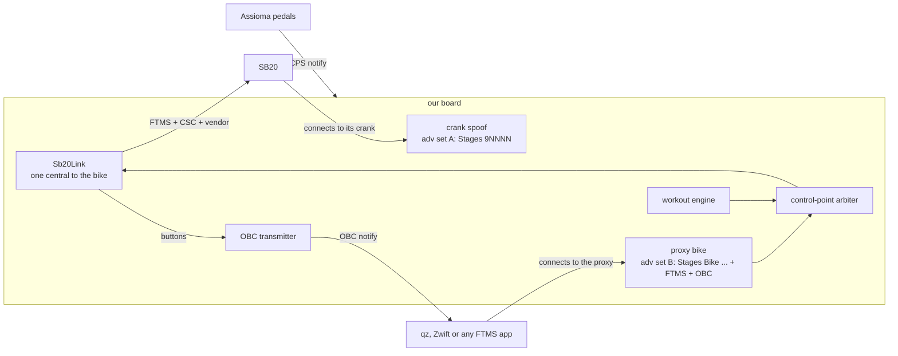

# SB20 full proxy — design (issue #291)

**Status: PROPOSED (2026-10-02) — design only, no code; the owner answered §9 Q1–Q4 and Q7 the same day.** The owner decided #291 on 2026-10-02:
**option 3, our hardware proxies everything** between the SB20 and qz (`decisions.md`, same date),
and the same day widened the consumer: **any FTMS trainer app**, so riders can use Zwift, MyWhoosh,
Rouvy and the like directly, without qz in the middle.
This note turns that decision into a buildable shape. §9 lists the questions the owner must answer
before code; §7 lists the cheap experiments that must pass first. Tracked as ROADMAP Next 9
("SB20 full proxy"); it is the on-bike blocker inside OBC complete (#367, Now #2). The runtime
reference ([`docs/system-reference.md`](../../docs/system-reference.md)) describes what exists today
and points here for what is planned.

## 0. The decision in one paragraph

Today qz connects to the SB20 directly, the bike stops advertising, and our shifter-sink central can
never find it: whoever attaches first locks the other out (session 13; system-reference §6.1, §8c).
Under the full proxy **our board is the only BLE central on the SB20**. It holds one link to the bike
and re-presents the bike as a second BLE personality, a standard FTMS bike that **any trainer app**
can pair: qz, or Zwift, MyWhoosh, Rouvy and the like directly. It carries the telemetry, the FTMS
control point (relayed both ways, so the app keeps erg and simulation control) and the button service.
No app connects to the SB20, so the deadlock cannot occur, and a restart or dropout cannot silently
invert an ordering.

## 1. What we know (measured, with sources)

**The SB20's GATT** (`captures/QDZ-sb20-ftms-gatt-20260706-0739.jsonl`, bike 1, `E4:AA:5A:D6:0E:D4`):

| Service | Characteristics (properties) | Proxy treatment |
|---|---|---|
| GAP `1800`, GATT `1801` | name, appearance, PPCP, CAR; Service Changed | our own |
| DIS `180A` | `Stages Cycling` · `SB20` · serial `H0512210105` · fw `1.1` · hw `0.0` · sw `1.12.4+3792` | mirror the bike's strings (read once at link-up) |
| FTMS `1826` | `2AD2` notify · `2ADA` notify · `2AD9` write+indicate · `2ACC` read `8a4000000e200000` · `2AD8` read `0000a00f0100` (0–4000 W, 1 W) · `2AD6` read `0000ff000100` · `2AD5` read `18fce8030100` | mirror: reads cached, notifies relayed, the control point relayed through the arbiter (§3c) |
| Vendor `0c46be5f` | `0c46be60` notify (the buttons; `shifter-ble-protocol.md`) · `0c46be61` notify | relay both notifies (qz's fork decodes `be60` natively) |
| Vendor `0c46beaf` | `0c46beb0` notify · `0c46beb1` write-no-response (the Stages app's channel, session 6) | **not mirrored** in v1 |
| CSC `1816` | `2A5B` notify · `2A5C` read · `2A5D` read · `2A55` write+indicate | relay `2A5B` and the reads; `2A55` only if a consumer needs it (§9) |
| Nordic DFU `fe59` | `8ec90003` write+indicate | **never mirrored** (a firmware-update path into the bike) |

The bike's 2026-07-06 notification flags: healthy Indoor Bike Data is `0x00c5`; a degraded cold start
sends `0x0011` (#288, system-reference §3).

**How qz finds and classifies the bike** (read in qz's `src/devices/bluetooth.cpp`, to understand only):
a name starting `STAGES BIKE` is an FTMS bike (`ftmsbike`); any *other* name starting `STAGES ` gets
qz's Stages power-bike class. Consequences: the proxy must advertise a name starting `Stages Bike`
with FTMS `0x1826`, and our crank spoof's `Stages 9NNNN` name already falls into qz's other class
(a latent hazard if qz is not pinned to a device name). qz can also match one exact configured
name, which is how a rider pins qz to the proxy (§3e).

**What qz does with it** (session 13 G1, 2026-07-26): qz connected to `Stages Bike 0105`, drove erg
over FTMS, and decoded all six buttons from `0c46be60` (on our fork, `RIGHT up → Plus
peloton_offset`). The adverts stopped once qz connected.

**An unresolved contradiction:** in the 2026-07-06 passive capture (qz on iOS) the bike's FTMS
address advertised all ride while qz drove resistance (`sessions/CAPTURE-qdomyos-sb20-passive.md`),
so that qz host was on some other link or personality. §9 Q6.

**Our board today** (`firmware/src/`): the crank-spoof peripheral (the SB20 connects to us), the meter
central, `FtmsErgClient` (its own `NimBLEClient` to the bike, when `trainerNameFilter` is set),
`BleShifterClient` (a *second* `NimBLEClient` to the same bike, by name `"Stages Bike"`), the OBC
service in our GATT, and one legacy advertising set (`BleCrankPeripheral.cpp`). NimBLE's connection
limit is the library default, **3** (`nimconfig.h`; nothing in `platformio.ini` raises it), so
crank + meter + erg + shifter already asks for 4. Reusable pieces: `FtmsTrainerServer` (the FTMS
server behind the bench trainer sim, `esp32c3-ftms-server`), the pure `Ftms.h` codec,
`ShifterDebounce` / `ObcShifterSource`.

## 2. Target topology

Every edge is opened by the side shown first. The SB20 sees exactly one central (ours) and one crank
(ours). The app sees one bike (ours).

## 3. Components

### 3a. `Sb20Link` — one connection to the bike, many consumers

One `NimBLEClient` owns the SB20 link: discovery by `Stages Bike` name plus `0x1826` the first time,
**by stored address afterwards** (RuntimeConfig `sb20Address`; this is ROADMAP Next 2's affinity work
and makes two bikes safe). At link-up it reads DIS and the FTMS static characteristics into a cache,
subscribes to `2AD2`, `2ADA`, `0c46be60/61` and `2A5B`, and fans every notification out to its
consumers: the proxy server, the workout engine's view of the bike, and the shifter debounce feeding
OBC. `FtmsErgClient` and `BleShifterClient` stop opening their own connections and become consumers.
This also retires the question in system-reference §11 of holding two links to one bike.

### 3b. `Sb20ProxyServer` — the bike as an app sees it

`FtmsTrainerServer` grows a relay mode: the FTMS service with the cached read values, `2AD2`/`2ADA`
forwarded as they arrive, and `2AD9` handed to the arbiter. Alongside it: the `0c46be5f` vendor
service relaying `be60`/`be61`, CSC `2A5B` and its reads, and DIS with the bike's strings. The DFU
service and the `0c46beaf` Stages-app channel are not mirrored. The proxy only starts advertising
once `Sb20Link` is up and the cache is filled, so qz never meets an empty bike.

**Telemetry is relayed verbatim (owner, 2026-10-02).** Every power correction happens *inbound* to the
bike, through the crank spoof, so the bike's own erg loop runs on corrected power; the bike's `2AD2`
therefore already carries the "power truth" the PELOTON reset asks for, and the proxy never rewrites
it (§9 Q3).

### 3c. The control-point arbiter

The bike has one control point and the proxy is its only writer. The arbiter is a pure state machine
(host-testable, `lib/proxy/`):

- **Owner:** `none`, `qz` or `head unit`. A consumer takes ownership with FTMS Request Control
  (`0x00`); the head unit takes it when a workout starts.
- **Granting (owner, 2026-10-02):** the first owner holds control; the other is refused, qz with the FTMS reply
  `0x80 00 05` (control not permitted), the head unit with a visible message. This enforces
  system-reference §6.3, "never two erg controllers on one bike", in code instead of in a rule.
- **Relaying:** one request in flight at a time; qz's write is forwarded unchanged, and the bike's
  `0x80 <op> <result>` indication is relayed back unchanged. The bike's `2ADA` status notifications
  (e.g. `0x08` Target Power Changed) go to every subscriber.
- **Failure replies:** no indication within a timeout, or the bike link is down, means the proxy
  answers `0x80 <op> 04` (operation failed) itself, so qz never waits forever.
- **Re-assertion:** after a bike-link drop and reconnect, the arbiter re-requests control and
  re-sends the owner's last Set Target Power (`0x05` + s16 W).

### 3d. Advertising: two sets

| Set | For | Primary packet | Scan response |
|---|---|---|---|
| A | the SB20 (crank) | `Stages 9NNNN` + CPS `0x1818`, byte-for-byte as today | the Stages UUID `d445fe01` |
| B | qz (the proxy bike, OBC consumers) | `Stages Bike …` + FTMS `0x1826` | the OBC service UUID `d273f680` |

A 128-bit UUID costs 18 of a packet's 31 bytes, so set A cannot also carry the OBC UUID. Set B's
scan response can, which solves #367's advertising-budget problem as a side effect. This needs
NimBLE extended advertising (`CONFIG_BT_NIMBLE_EXT_ADV`, at least 2 instances, legacy PDUs so old
scanners still see both). **Caveat:** NimBLE has one GATT database, so a client of either set
discovers every service: the SB20 would see FTMS and the vendor services next to our crank, and qz
would see CPS and the Stages crank service next to the bike (§7 E3).

### 3e. Naming, two bikes, and pinning qz

**Decided (owner, 2026-10-02):** the proxy advertises the bike's own name plus ` PXY`, e.g.
`Stages Bike 0105 PXY` (a 22-byte name element; with flags and the 16-bit FTMS UUID the packet is 29
of 31 bytes). It reads
as "the proxy for bike 0105", it is unique per bike without any new configuration, and it still
starts with `Stages Bike`. The rider sets qz's FTMS bike name to it once, so qz can never pick the
real bike directly, even before our board is up. (§9 Q4.)

### 3f. Connection budget

| Link | Role | Count |
|---|---|---|
| SB20 → our crank | peripheral | 1 |
| our board → meter | central | 1 |
| our board → SB20 (`Sb20Link`) | central | 1 |
| qz → the proxy | peripheral | 1 |
| an OBC consumer on a different host | peripheral | 0–1 |

Four to five links against a limit of 3 today: raise `CONFIG_BT_NIMBLE_MAX_CONNECTIONS` (with the
controller's own limit and the per-link heap cost measured on the C3; §7 E2). The nRF already
starts Bluefruit with 2 peripheral and 3 central links, which fits; it follows the ESP32 (§9 Q5).

### 3g. Consumers beyond qz (owner, 2026-10-02)

The proxy is a standards-conforming FTMS bike, so any app that pairs an FTMS trainer can use it with
no qz in the middle. What that adds to the design:

- **Every control-point op is relayed, not just erg.** Zwift's free rides use Set Indoor Bike
  Simulation (`0x11`), other apps use Set Target Resistance (`0x04`); the bike's `2ACC` advertises
  simulation support (Target Setting bit 13). The arbiter forwards every op unchanged and owns only
  the question of *who* may write.
- **Power source:** an app may take power from the proxy's FTMS `2AD2`, or offer our CPS service
  (the crank spoof's, present in the same GATT, §3d) or the Assiomas themselves. All carry the same
  corrected numbers; the rider picks one.
- **Buttons:** OBC reaches the apps that speak it (MyWhoosh, Rouvy and the others the OBC spec
  lists) and qz's fork decodes the relayed `0c46be60` natively. **Zwift speaks neither**: its own
  controller protocol is the parked `zwift-controls-research.md`. With Zwift directly, erg,
  simulation and telemetry work through the proxy, and the SB20's buttons do not reach Zwift. **Out of
v1 (owner, 2026-10-02):** the owner rides MyWhoosh, which speaks OBC; the Zwift-controller work stays
parked (§9 Q7).
- **Naming:** apps other than qz pick the device from a list, so the proxy's name only has to be
  recognisable; qz needs the `Stages Bike` prefix (§3e).
- **One app at a time in v1:** a second FTMS consumer costs a link and would be refused control by the
  arbiter anyway.

### 3h. Releasing the bike

With the proxy holding the bike's only link, **the Stages app cannot connect** to pair cranks or to
apply its suspected cold-start "wake" (#288). The proxy needs a **release** control on the device
and in `/app`: drop `Sb20Link` and stop set B, keep the crank spoof running, and reconnect on
request. Crank pairing is a setup-time act, so this is a maintenance switch, not a ride feature.

## 4. Data paths and latency

Every relayed notification is forwarded on arrival with no batching; button frames stay one per
press, as the OBC spec requires. Target: bike-to-qz relay latency under 50 ms, the same figure OBC
certification asks for a button press. Measure it on the bench with timestamps on both sides of the
board (§8).

## 5. Failure handling

| Event | Proposal |
|---|---|
| Bike link drops | keep qz connected; stop relaying; `/status` and the screen say so; reconnect by address (the bike advertises again once free); re-subscribe; the arbiter re-asserts control and the last target |
| qz disconnects mid-ride | keep the bike link (the head unit and OBC carry on); release qz's ownership; **the bike holds its last target** (owner, 2026-10-02) |
| Our board reboots | the bike loses its crank and its controller together; on boot: set A first, then `Sb20Link`, then set B; qz reconnects to the pinned proxy name |
| Telemetry boots degraded (`0x0011`) | relay as is, and flag it on `/status`; the cause is #288 |
| A second consumer asks for control | refused per §3c |

## 6. What changes in the code (a map, not code)

- **New, pure and host-tested in `firmware/lib/proxy/`:** the arbiter state machine (ownership,
  request/response pairing, timeouts, re-assertion) and the mirror cache (validated static reads).
  Golden vectors come from the real captures: `QDZ-sb20-ftms-gatt-20260706-0739.jsonl` for the static
  reads and the `G-sb20-ftms-erg*` captures for control-point traffic.
- **New seam in `firmware/src/ble/`:** `Sb20Link` (one client, many consumers) and the relay mode of
  `FtmsTrainerServer`.
- **Refactored:** `FtmsErgClient` and `BleShifterClient` become `Sb20Link` consumers;
  `BleCrankPeripheral` moves to advertising set A.
- **Config:** `RuntimeConfig` gains `proxyEnabled`, `sb20Address` and `proxyName` (derived default).
- **Instruments and UI:** `/status` gains the bike link, the proxy client and the control-point owner;
  `/app` gains the proxy card and the release switch; `docs/ui-feature-map.md` gains the rows.

## 7. Experiments before code (cheap, mostly bench)

- **E1** NimBLE extended advertising with two legacy-PDU sets on the C3 (Arduino-ESP32 2.0.16) and on
  the S3 (pioarduino): both sets visible to `sniff_ble.py` and to a phone scanner.
- **E2** five simultaneous links on the C3: heap floor and `perf_soak.py` with the crank cadence and
  the meter link holding.
- **E3** the shared GATT: does qz accept a bike whose GATT also has CPS and the Stages crank service
  (bench: qz against our board)? Does the SB20 still pair to a crank whose GATT also has FTMS and the
  vendor services (bike: one session-14 gate)?
- **E4** the relay end to end on the bench: the FTMS trainer sim stands in for the SB20 (add the
  `0c46be5f` vendor service to the sim so buttons can be faked), qz on the desktop drives erg through
  the proxy, and the sim's log shows every target.
- **E5** latency: bike-side and app-side timestamps for `2AD2` and the control point.
- **E6** apps other than qz: Zwift, and MyWhoosh or Rouvy, pair the proxy on the bench (the trainer sim
  as the bike) and run an erg workout and a free ride; the sim's log shows Set Target Power and Set
  Indoor Bike Simulation (`0x11`) arriving through the arbiter.

## 8. Validation path

Bench first (E1–E5 with the trainer sim as the bike), then one bike gate in session 14: the crank
spoof still pairs (E3), qz pinned to the proxy name drives erg through it, Zwift paired directly
runs erg and a free ride with no qz in the room, the six buttons reach qz
natively and over OBC, a bike-link drop and a qz drop each recover per §5, and the release switch
lets the Stages app in.

## 9. Questions for the owner

Answered by the owner on 2026-10-02:

1. **Erg contention:** whoever took control first keeps it; the other is refused with a visible
   reason (§3c).
2. **qz disconnects mid-interval:** the bike **holds** its last target (§5).
3. **Telemetry:** **pass through unchanged.** All power adjustment happens inbound to the bike, by
   spoofing the crank, so the bike can still run its own erg loop (§3b).
4. **The proxy's name:** the bike's name plus ` PXY`, e.g. `Stages Bike 0105 PXY` (§3e).
7. **Buttons in Zwift:** out of v1. The owner rides MyWhoosh (OBC) rather than Zwift now; the
   Zwift-controller work stays parked (§3g).

Still open:

5. **Scope:** the ESP32 boards first (C3 basic mode and the LCD head units), the nRF after?
6. **The iOS observation:** on the next qz ride from the iPhone, read the connected device's name off
   qz's screen, so we know which personality an iOS qz uses (§1).
