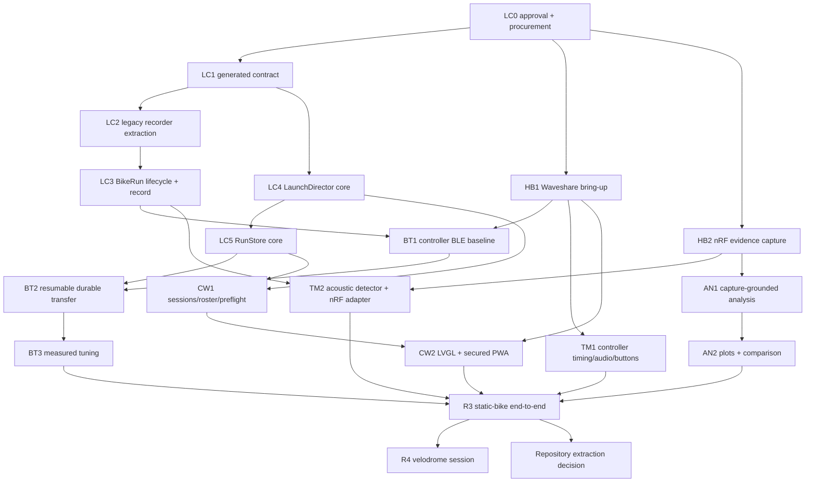

# Track launch control - phased research and implementation plan

**Status: APPROVED PLANNING BASELINE - IMPLEMENTATION PAUSED**

**No implementation starts until this plan and the companion specification are approved.**

**Date:** 2026-07-20

Product/technical contract:
[`track-launch-control-spec.md`](track-launch-control-spec.md). Research and owner decisions:
[`track-launch-control-research.md`](track-launch-control-research.md). BLE transfer detail:
[`track-launch-ble-transfer.md`](track-launch-ble-transfer.md).

## 1. Delivery discipline

This feature is delivered as a sequence of small PRs, not one feature branch.

Every slice follows the same loop:

1. **Research:** read the canonical finding/capture and identify the unresolved fact.
2. **Plan:** state the slice's interface, acceptance proof and stop condition in the PR.
3. **Implement:** pure module first; hardware/transport adapter only after its test surface exists.
4. **Prove:** run the cheapest sufficient host test, target compile and required bench check.
5. **Record:** update findings, append durable measured decisions, and distinguish built from validated.
6. **Merge:** green CI, fresh survey of `origin/main` and open PRs, regular merge, delete branch.

No slice may invent protocol bytes, analysis thresholds, throughput claims or timing accuracy. Real
captures win.

## 2. Product/module boundary

V1 remains in this repository. New controller-specific code lives under a clear root product area:

```text
track-launch/
  controller/       Waveshare PlatformIO firmware and hardware adapters
  web/              launch PWA source/tests, using shared tokens/security patterns
  test/             controller native/integration tests and fixtures
  README.md          build, flash and bench loop
```

Bike-side code stays in `firmware-nrf/`, with launch policy moved behind a `BikeRun` module rather than
adding more state to `main.cpp`. Shared wire definitions remain in the existing `ui-schema/` generation
line. Shared pure modules are reused from `firmware/lib/` only when their current interfaces fit; do not
copy them into `track-launch/`.

After the R3 static-bike gate, perform the recorded repository-extraction decision. Do not extract before
the shared contract and real lifecycle are stable.

Cross-project build coupling is explicit, not informal:

- the controller PlatformIO project uses declared `lib_extra_dirs` for the one shared C++ Bridge protocol
  header and selected pure modules in `firmware/lib/`;
- `design/gen_tokens.py` gains the launch UI as a checked output instead of copying generated colors;
- the controller gets its own native and native-LVGL environments using the existing shim/hook pattern,
  not the existing crank UI source; and
- CI builds/tests all three firmware trees so a shared-header change cannot silently break the controller.

## 3. Dependency map



Slices in the same column may be prepared in parallel only when they do not edit the same files or require
the same physical rig. The BLE radio, Waveshare board and nRF hardware are serialized resources.

### Mapping the research gates

The earlier research document used R0-R4 before this implementation plan was decomposed:

- research **R0** (real source capture) -> **HB2**;
- research **R1** (pure host model) -> **LC1-LC5**;
- research **R2** (bench timing/coexistence/transfer) -> **HB1-HB2, BT1-BT3 and TM1-TM2**;
- research **R3** remains the static-bike end-to-end gate; and
- research **R4** remains the velodrome session.

An R2 microphone failure is still stop-the-line for production acoustic detection: HB2 updates the spec
before TM2 can proceed.

## 4. LC0 - approval, procurement and evidence setup

### Goal

Freeze the planning contract and make the first hardware session turnkey.

### Owner approval gate

- Approve `track-launch-control-spec.md`.
- Approve this phased plan.
- Confirm implementation may begin.

### Procurement

- Waveshare ESP32-S3-Touch-LCD-3.5, standard version.
- Known-good microSD card.
- External USB-C power bank/cable.
- Candidate speaker/transducer and any required amplifier/driver.
- Green START and distinct red ABORT momentary controls.
- Opto-isolated input parts/module supporting dry contact and 5-24 V pulse.
- Serviceable connectors/harness; no custom PCB.
- nRF LiPo sized from the three-hour target plus measured current.
- Materials for the top-tube 3D-printed/rubber-band case.

### Desk preparation

- Archive official Waveshare schematic, pin map, example source and license reference.
- Read [`advanced-board-s3-touch.md`](advanced-board-s3-touch.md) before board setup. Start from its proven
  ESP32-S3 pioarduino/PlatformIO, NimBLE + SoftAP + LVGL recipe and recorded gotchas; only the 3.5-inch
  board's pin map and peripheral drivers are new.
- Produce a pin-allocation table: display/touch/audio/SD/PMIC/RTC, direct trigger, buttons and debug.
- Confirm which pin can provide a direct interrupt for the external trigger.
- Confirm speaker output electrical capability before attaching an external load.
- Define measurement equipment for timer-to-acoustic onset, current draw and BLE logs.

### Exit

No code. Approved documents, ordered hardware and a checked bench worksheet.

## 5. LC1 - generated launch contract

### Goal

Make one parity-locked contract before either firmware implements launch behavior.

### Change

- Extend existing `ui-schema/bridge.json`; do not create a parallel codec.
- Add schema/golden definitions for:
  - capabilities/hello;
  - preflight request/report;
  - arm plan/ack;
  - run status and abort;
  - run manifest;
  - stream/window request and data;
  - range/window ACK/NACK;
  - matching durable erase ACK.
- Extend `code/scripts/gen_bridge.py` only as required for variable/windowed records.
- Use the generator's existing variable/count-prefixed array support (`ScanList` is the precedent) before
  adding a new schema mechanism.
- Generate the JS mirror, canonical vectors and C++ golden fixture. Keep `Proto.h` hand-written and checked
  against the generated fixture, as the current generator deliberately does.
- Share that one pure C++ protocol header with the controller; do not hand-write an ESP32 copy.
- Add declared controller `lib_extra_dirs` and CI jobs that compile/test the shared header from both
  firmware projects.
- Document major-version compatibility and the legacy RecCtl adapter.

### Proof

- `py code/scripts/gen_bridge.py --check`
- `node web/test/bridge-codec.test.mjs`
- `firmware-nrf`: `pio test -e native`
- Golden malformed/newer-version cases.

### Stop conditions

- The schema generator cannot express a required variable record without unsafe hand-written offsets.
- Legacy Web/Garmin behavior cannot be preserved or explicitly version-gated.

Resolve the contract design before continuing; do not let each consumer improvise.

## 6. LC2 - extract the existing recorder behind `BikeRun`

### Goal

Create the bike-side seam without changing proven recorder behavior.

### Change

- Move RecCtl state, `ImuCapture<8192>`, download cursor and ACK/erase policy out of `main.cpp` into a pure
  `BikeRun` module.
- Keep the existing RecCtl/RecData GATT behavior through a thin legacy adapter.
- Keep current linear capture and framing in this slice.
- Make clock and sample/event inputs explicit dependencies.

### Proof

- Existing framing/golden tests remain unchanged and green.
- New tests exercise start/stop/download/erase through the `BikeRun` interface.
- Regression test proves sequence 254 cannot resemble the trailer.
- `pio run -e xiao-sense` compiles.
- Existing live IMU self-test remains behaviorally identical on the nRF bench.
- Correct `firmware-nrf/GATT.md` in the same slice if any recorder contract changes.

### Why separate

This is a behavior-preserving extraction. Mixing it with new lifecycle states would make regressions
impossible to localize.

## 7. LC3 - launch lifecycle and lossless bike run

### Goal

Implement the pure one-run state/data contract before wiring new hardware behavior.

### Change

- Add the full sensor states from the spec.
- Add immutable `ArmPlan` validation and run identity.
- Add the fixed 10-second scheduled pre-roll. Define an extension point for a future rolling pre-roll, but
  do not implement the installed-system ring path in v1.
- Preserve raw variable-length CPS events with local arrival markers.
- Represent timing markers, dropouts, abort/degraded flags and quality evidence.
- Add offset/window reads and matching durable acknowledgement.
- Prevent overwrite of `COMPLETE_UNACKNOWLEDGED`.

### Proof

- Synthetic timelines cover 20/40/70-second runs, exact sample counts and counter wrap.
- Abort before/after GO.
- Meter/microphone dropout after START.
- Disconnect/resume and duplicate requests.
- Wrong run ID/CRC ACK rejected.
- Maximum record fits the measured/compiled RAM budget with documented headroom.
- Legacy adapter tests remain green.

No microphone threshold or reaction algorithm belongs in this slice.

## 8. LC4 - pure `LaunchDirector`

### Goal

Put coach workflow in one deep, host-tested module before LVGL, HTTP or BLE callbacks own policy.

### Change

- Implement revisioned event/effect state machine.
- Encode session/rider/sensor/meter selection.
- Encode preflight, overrides, `ARMED`/START separation and deterministic fault policy.
- Encode abort, waiting-for-return, blocking download, run-at-risk and reboot recovery.
- Emit one `LaunchView` consumed by LVGL and PWA JSON.
- Use fake clock, BLE, audio, storage and button events in tests.

### Proof

- Transition table tests cover every state/event pair that may change behavior.
- Physical and HTTP START/ABORT produce identical typed events.
- Replayed duplicate commands are idempotent.
- Phone disconnect has no effect on autonomous states.
- Reboot never restores ARMED/countdown.
- A retained run blocks every next-rider path.

## 9. LC5 - `RunStore` durability core

### Goal

Prove durable staging/recovery through a filesystem seam before microSD wiring.

### Change

- Implement run-ID staging, offset writes, range completeness and idempotent retries.
- Re-read whole staged object for final CRC.
- Implement a recoverable close/commit-marker/rename sequence proven on the target filesystem; do not
  assume a FAT rename is power-loss atomic.
- Recover final/staged/corrupt objects after simulated reset.
- Model storage-full and write/finalize failure.

### Proof

- Native tests with a temporary/in-memory filesystem adapter.
- Reset injection after manifest, middle chunk, final chunk and before/after rename.
- Duplicate/out-of-order chunks produce one correct object.
- No `DurableAck` effect until re-read verification passes.

The real SD adapter lands later; the `RunStore` interface is already the test surface.

## 10. HB1 - Waveshare hardware bring-up

### Goal

Prove each chosen board facility independently, with no product workflow.

### Change

- Create the minimal `track-launch/controller/` PlatformIO target.
- Base it on the proven pioarduino S3 toolchain/gotchas in
  [`advanced-board-s3-touch.md`](advanced-board-s3-touch.md), not a green-field stock-espressif32 setup.
- Bring up display, capacitive touch, microSD, audio codec/output, RTC, USB serial and PMIC behavior.
- Read physical START/ABORT and direct trigger pins.
- Compile a minimal NimBLE central plus SoftAP coexistence smoke.
- Reuse generated design tokens and host LVGL hooks where they fit.
- Add the launch token output to `design/gen_tokens.py`/sync tests. Reuse the native-LVGL shim pattern,
  while compiling launch-specific screens rather than the existing crank UI.

### Bench proof

- Target compiles from a clean environment.
- Controller native, native-LVGL and real-target environments run in CI with declared shared include paths.
- Touch/display orientation and dimensions correct.
- SD write/read/rename/reset smoke.
- Known tone observed at audio output and external transducer without unsafe load.
- Buttons distinguishable; ABORT read path does not depend on touch/HTTP.
- Direct trigger edge timestamped under UI/WiFi load.
- SoftAP remains reachable while BLE scans/connects.
- Record board revision, libraries and pin map in `track-launch/README.md`.

### Stop conditions

- No safe direct trigger pin.
- Audio path cannot drive or control an appropriate transducer.
- Required board source/license/toolchain is not reproducible.

Resolve hardware before product wiring. Do not hide a board mismatch behind an expander/polling hack.

## 11. HB2 - nRF evidence capture, timing and battery

### Goal

Capture the raw evidence needed to design microphone detection, motion analysis and runtime thresholds.

### Instrument-only changes

- Add bounded raw/diagnostic microphone capture around expected GO; no production detector yet.
- Add IMU interval/jitter/loss telemetry at 104 Hz under intended BLE meter links.
- Add real battery voltage/current telemetry hooks.
- Preserve source meter raw CPS and arrival timing.
- Add a reproducible download of these evidence streams.

### Captures

- Speaker at 1/3/5 m, quiet and representative venue noise.
- Standard top-tube/head-tube mount plus at least one alternate diagnostic placement.
- Several stationary preload/release motions and static-bike launches.
- Paired high-frame-rate video.
- Intended BLE meter standing starts.
- Concurrent ANT capture where available, only to decide whether ANT adds material event timing.
- Battery discharge under idle, armed, recording and downloading load.

Commit lossless captures in the established capture area and index them. Do not edit raw captures.

### Exit

- Acoustic onset/SNR distribution is known.
- 104 Hz jitter/loss under load is measured.
- Three-hour battery target and critical reserve voltage are grounded.
- BLE CPS event rate/content during a real launch is known.

If microphone or mount evidence fails, update the spec before production detector work.

## 12. BT1 - ESP32-to-nRF BLE baseline

### Goal

Measure the current path on the actual controller before optimizing it.

### Change

- Add only the controller BLE adapter needed to bond/connect, read capabilities and download the current
  RecData stream into a diagnostic sink.
- Report actual MTU, PHY, DLE/data length, connection interval, RSSI, frames and effective bytes/s.
- Keep PWA traffic controllable for coexistence cases.

### Matrix

- 20/40/70-second payloads.
- MTU-23 fallback versus explicitly negotiated MTU.
- WiFi off/SoftAP idle/PWA polling/heavy HTTP.
- Near bench and 5 m.
- Intended nRF source-meter links active.
- At least 10 repeats per selected cell.

### Decision

Bring the measured distribution to the owner and then set the default/max wall-clock target. Do not set
it from arithmetic alone.

## 13. BT2 - resumable durable transfer

### Goal

Make transfer correct before making it fast.

### Change

- Wire generated manifest/window/ACK contract to `BikeRun`.
- Wire controller BLE adapter to `RunStore`.
- Track gaps/ranges and request only missing windows.
- Resume staging after disconnect/controller reset.
- Finalize, verify and send matching durable ACK.
- Auto-reconnect/download when the selected sensor returns.
- Keep next-rider workflow blocked until completion.

### Proof

- Forced disconnect at 10/50/90 percent.
- Duplicate, missing, reordered and corrupted frames.
- Controller reset and nRF reconnect.
- microSD full/write/finalize failures.
- Wrong run ID/CRC durable ACK.
- Ten consecutive maximum transfers with zero invalid success.

No transfer may be considered complete from "last notification sent."

## 14. BT3 - measured throughput tuning

### Goal

Meet the owner-approved target using the simplest proven GATT configuration.

### Ordered experiments

1. Explicit MTU 247 negotiation and observed-value gate.
2. DLE request/verification.
3. Raise frame cap from 14 to 19 samples at MTU 247.
4. Quiet non-essential PWA polling/HTTP during transfer.
5. 2M PHY.
6. Shorter connection interval.
7. Revisit notification queue/event length only after reproducing the prior Bluefruit multi-link failure.

Run one-variable-at-a-time benchmarks and append measured results to the performance log. Stop when the
approved target and reliability gates are met. Do not add L2CAP CoC or compression unless tuned GATT still
fails.

## 15. TM1 - controller timer, audio and physical controls

### Goal

Produce a deterministic standalone T-15 sequence independent of phone scheduling.

### Change

- Hardware-timer-driven `track-gate-15-v1` scheduler.
- Audio adapter for long/short/distinct-GO cues.
- Physical START/ABORT adapter feeding `LaunchDirector`.
- Optional isolated trigger raw capture/silent mode only; do not expand installed-system scope.

### Proof

- Logic-analyzer/timestamp test of scheduled cue edges.
- Microphone measurement of command-to-acoustic onset and variability.
- ABORT before/after GO behavior and immediate silence.
- PWA disconnect/sleep cannot change cadence.
- UI rendering and HTTP load do not change cue spacing.
- Audibility and nRF detectability at the required all-in-one 5 m geometry.

## 16. TM2 - nRF plan execution and acoustic T0

### Goal

Turn HB2 evidence into the bike-local timing path.

### Change

- Accept/validate complete `ArmPlan`.
- Execute fixed pre/post deadlines locally.
- Implement acoustic detector chosen from committed captures.
- Preserve a bounded audit trace around GO.
- Implement once-per-sensor/session/remount acoustic preflight result.
- Select acoustic or automatic low-confidence BLE T0 with explicit reason.
- Add battery reserve gate from discharge evidence.

### Proof

- Detector runs against every committed positive/negative audio fixture.
- False/missed detection matrix across distance/noise/mount.
- BLE fallback never receives high-confidence classification.
- Synthetic and real timelines preserve one nRF clock domain.
- Full nRF target compile and bench replay.

No threshold is tuned only on the successful examples.

## 17. CW1 - sessions, roster, enrolment and preflight

### Goal

Build the persistent coach workflow on top of `LaunchDirector`.

### Change

- Persistent riders, preferred meters, sensors/visible labels and assignments.
- Explicit active training sessions.
- BLE enrolment/bonding mode; normal remembered-sensor filter.
- Full preflight report and override audit.
- Reboot recovery to unarmed state.
- Explicit run deletion and storage-pressure handling.

### Proof

- Pure persistence round-trips and schema migration tests.
- Bond/unknown-sensor bench cases.
- Bond-loss recovery after controller reset, nRF re-flash and corrupt/missing bond state; physical
  forget/re-enrol must recover without reflashing either product.
- Wrong/stale/preferred meter cases.
- Missing microphone automatic fallback.
- Critical battery and occupied-slot hard blocks.
- microSD failure allows one at-risk run then blocks.

Reuse per-device SoftAP/QR/security modules; do not build a second onboarding system.

## 18. CW2 - controller LVGL and offline PWA

### Goal

Expose one `LaunchView` and one command model through both coach surfaces.

### Controller

- Session/rider selection.
- Preflight and overrides.
- ARMED/countdown/abort/wait/download.
- At-risk/storage/recovery.
- Last-run headline summary.

### PWA

- Roster/session/sensor/meter editing.
- Same operational state/commands.
- Summary, retained runs and explicit deletion.
- Offline assets served by the controller.

### Interface

- `GET /api/launch`
- idempotent revisioned `POST /api/launch`
- immutable run/stream reads

### Proof

- Host LVGL tests through existing in-memory hooks.
- HTTP command/state tests with CSRF/auth and revision conflict cases.
- Action-parity tests: LVGL, physical and PWA controls emit the same Director events.
- PWA reconnect reloads state; phone absence does not block controller operation.
- Generated tokens/schema stay in sync.

## 19. AN1 - capture-grounded analysis

### Goal

Derive the smallest honest reaction/power summary from real captures.

### Research first

- Prototype candidate first-motion algorithms in Python against committed IMU/audio/video truth.
- Quantify expected gate preload and release movement.
- Identify first crank/torque event behavior in real CPS.
- Select early power/cadence windows supported by source rate.
- Define uncertainty/confidence propagation.

### Implementation

- Freeze algorithm/version only after comparison.
- Add pure controller C++ `RunAnalyzer`.
- Keep Python reference analysis.
- Use one shared set of real-capture golden cases for Python/C++ parity.

### Proof

- Blind/held-out starts, not only tuning examples.
- Video-labelled error distribution.
- Missing/dropout/aborted/low-confidence cases.
- No IMU speed/distance output.

If first movement cannot be separated from frame/gate preload, return to the owner with wheel-sensor
evidence rather than forcing a threshold.

## 20. AN2 - plots and one-run comparison

### Goal

Deliver immediate coaching value without adding speculative analytics.

### Change

- Bounded run-stream HTTP reads.
- T0-aligned IMU, gyro, audio evidence, power/cadence and event markers.
- Current run versus one selected prior run.
- Compatibility warnings for rider/profile/confidence/data-quality mismatch.
- Controller last-run headline projection.

### Proof

- PWA rendering against committed run fixtures.
- Longest-run memory/response-size check.
- Missing stream and degraded-run views.
- No comparison silently pools BLE fallback with acoustic timing.

Lossless user export remains later scope.

## 21. R3 - static-bike end-to-end gate

This is the first full product proof and the gate before any velodrome session plan.

### Run

1. Power controller and sensor from realistic sources.
2. Create session/rider, enrol/assign sensor, select preferred meter.
3. Mount in the standard top-tube position.
4. Run acoustic preflight.
5. Preflight -> ARMED -> physical/PWA START.
6. Simulate rider leaving BLE range.
7. Capture default and maximum runs with high-frame-rate video.
8. Return, auto-resume/download, durable verify/ACK.
9. Review summary/plots and compare one prior run.
10. Exercise abort, meter dropout, microphone fallback, controller reboot, transfer interruption and SD
    failure/recovery.

### Exit

- Every acceptance item in the specification has evidence.
- Throughput target is measured and met or explicitly renegotiated.
- No run is lost or falsely accepted in the fault matrix.
- Owner accepts the coach workflow.
- Findings and durable numeric decisions are recorded.

### Architecture decision

Only now decide whether to extract `track-launch/` into its own repository. Evaluate actual release
coupling to `firmware-nrf`, schema generators, captures and shared UI/security modules.

## 22. R4 - velodrome session

Create the physical session document only after R3 is complete, following `sessions/PLAYBOOK.md`.

### Goals

- Multiple real standing starts with high-frame-rate video truth.
- Real track noise, mount vibration, rider preload and radio range.
- Coach workflow timing, especially return download before the next rider.
- Validate the three-hour battery and 5 m all-in-one audio geometry.
- Compare first-motion algorithms and quantify uncertainty.

### Required outputs

- Lossless captures committed/indexed.
- Session plan annotated in place with actuals.
- Durable values/findings appended to `decisions.md`.
- Summary/analysis thresholds updated only from evidence.
- Session retro folded into `sessions/PLAYBOOK.md`.

No marketing/accuracy claim is made from a single rider or a single start.

## 23. Deferred tracks

Start only from evidence after R4:

- ANT+ receive if paired BLE/ANT captures prove better launch events.
- Wheel sensor if IMU cannot distinguish preload/release.
- Larger nRF persistence if return download blocks real coaching cadence.
- Installed timing adapters after inspecting a named venue system.
- Multi-rider simultaneous starts.
- Lossless export/cloud.
- Custom PCB/enclosure.
- Independent repository extraction if R3 shows a real lifecycle split.

## 24. Completion checklist

Planning is complete when:

- [x] Owner approves the product/technical specification.
- [x] Owner approves this phased plan.
- [x] Findings index and links are green.
- [x] No implementation changes are present in the planning work.

V1 implementation is complete only after:

- [ ] LC1-LC5 pure contract/state/storage modules are green.
- [ ] HB1/HB2 hardware and evidence gates pass.
- [ ] BT1-BT3 durable transfer is measured and accepted.
- [ ] TM1/TM2 deterministic timing and T0 paths pass.
- [ ] CW1/CW2 coach workflow passes both surfaces.
- [ ] AN1/AN2 are grounded in real captures.
- [ ] R3 static-bike acceptance passes.
- [ ] R4 velodrome results are recorded and promoted.
