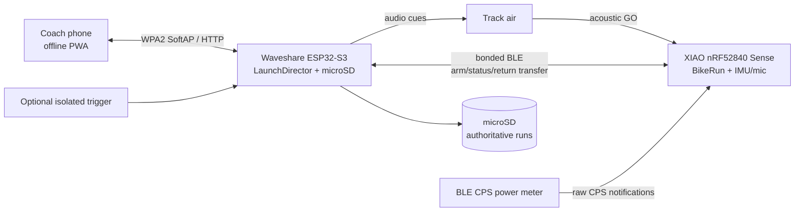

# Track launch control - product and technical specification

**Status: APPROVED PLANNING BASELINE - IMPLEMENTATION PAUSED**

**Planning only:** this document authorizes no implementation.

**Date:** 2026-07-20

This is the build contract for the first usable Track Launch Control system. The research trail and owner
interview are in [`track-launch-control-research.md`](track-launch-control-research.md). BLE transfer
research is in [`track-launch-ble-transfer.md`](track-launch-ble-transfer.md). The phased delivery plan is
in [`track-launch-control-plan.md`](track-launch-control-plan.md).

## 1. Product outcome

A track coach can select a rider, verify the rider's portable bike sensor and power meter, arm a standing
start, run a deterministic audible T-15 countdown, and receive a synchronized reaction/acceleration/power
record when the rider returns.

The system must:

- capture the bike's first movement and first crank/torque event against the same local start marker;
- preserve raw evidence, not only derived metrics;
- continue recording after the bike leaves the coach's radio range;
- automatically and safely download the only run copy on return;
- give the coach an immediate summary, synchronized plots and one-run comparison;
- work without venue internet or a continuously connected phone; and
- fail visibly without silently mixing low-confidence and high-confidence results.

## 2. V1 product boundary

### Included

- One Waveshare ESP32-S3-Touch-LCD-3.5 coach controller, standard version.
- One selected XIAO nRF52840 Sense bike sensor per run; remember many sensors.
- One preferred BLE CPS power meter per rider, editable per run.
- One active rider/run at a time.
- Fixed T-15 start profile with hardware-tuned cue frequencies.
- 104 Hz six-axis IMU, 10-second pre-roll and 10-60 seconds after GO; default 30 seconds.
- Primary bike-local acoustic GO detection and automatic low-confidence BLE fallback.
- One completed run retained in nRF RAM until durable controller acknowledgement.
- Automatic, resumable BLE return download to controller microSD.
- Offline controller-hosted PWA plus operational LVGL screen.
- Rider roster, sensor assignment, explicit training sessions and retained run history.
- Immediate summary, synchronized plots and current-versus-one-prior-run comparison.
- Separate physical START and ABORT controls plus equivalent PWA controls.
- External USB-C power bank for the controller.
- Generic isolated timing input as a low-priority compatibility seam.

### Explicitly deferred

- ANT+ power-meter receive unless real paired captures prove material launch value.
- 208 Hz IMU, wheel sensors, photogates, finish beacons and UWB.
- Multiple riders starting simultaneously.
- Flash-backed multi-run storage on the nRF.
- Lossless user export, cloud sync and app-store applications.
- Rider-visible scoreboard/countdown.
- IMU-derived speed or distance.
- Multi-run/cohort analytics and automated coaching recommendations.
- Venue-specific timing protocols or substantial installed-system integration.
- Custom controller PCB.
- Claimed reaction-time accuracy before video-grounded velodrome captures.

## 3. System architecture



The phone is a client, never the stopwatch or durability boundary. The controller owns the countdown,
audio output, coach workflow and microSD. The nRF owns the bike-local monotonic timeline, IMU, microphone,
raw CPS capture and the unacknowledged run.

BLE disconnection during the launch is expected. The complete schedule and capture deadline are accepted
before START, so no packet is required while the rider is moving away.

## 4. Deep modules and seams

The product is organized around four deep modules. Hardware and transport code are adapters at their
natural seams; they do not own product policy.

### 4.1 `LaunchContract`

**Purpose:** one schema/parity definition of BLE frames, controller HTTP commands/state, run records and
golden vectors.

**Interface:** versioned schemas, codecs and golden vectors. Callers know message meaning, ordering, errors
and size limits; they do not know byte offsets.

**Implementation hides:** byte layout, endianness, optional-field encoding, compatibility rules and
golden-vector generation. The existing generator emits the JS codec, canonical vectors and C++ golden
fixture; C++ `Proto.h` remains hand-written domain logic asserted against those vectors.

**Reuse:** extend the existing `ui-schema/bridge.json`, `ui-schema/bridge-golden.json`,
`web/bridge-codec.js` and generation/check tooling. Do not create a second hand-written launch codec.
The controller and nRF share the same pure C++ protocol header rather than maintaining C++ twins.

**Consumers:** nRF C++, ESP32-S3 C++, PWA JavaScript and protocol tests. Existing Garmin/Web Bluetooth
consumers must either understand the new major version or remain on a documented legacy adapter.

### 4.2 `BikeRun`

**Purpose:** own exactly one bike-side launch lifecycle.

Illustrative interface:

```cpp
PrepareResult prepare(const ArmPlan&, const PreflightSnapshot&);
BikeEffects handle(const BikeEvent&);
TransferWindow read(const TransferRequest&) const;
AckResult acknowledge(const DurableAck&);
BikeRunStatus snapshot() const;
```

The interface includes these invariants:

- `prepare` cannot overwrite `COMPLETE_UNACKNOWLEDGED`;
- accepted `ArmPlan` is complete and autonomous;
- events use nRF monotonic timestamps;
- transfer reads are idempotent and offset/window addressable;
- only a matching run ID plus verified CRC acknowledgement permits erase/overwrite; and
- abort before GO discards, while abort at/after GO retains a tagged partial run.

**Implementation hides:** fixed versus rolling pre-roll, sample indexing, event buffering, dropout ranges,
T0 selection, CRC, resume offsets and timeout arithmetic.

**Internal adapters:** IMU, microphone, CPS source, monotonic clock, battery monitor and BLE GATT. Tests
use in-memory adapters and synthetic timelines through the same interface.

### 4.3 `LaunchDirector`

**Purpose:** own coach workflow and all state transitions on the controller.

Illustrative interface:

```cpp
DirectorEffects dispatch(const DirectorEvent&);
LaunchView view() const;
```

Commands from LVGL, physical buttons and HTTP become the same typed `DirectorEvent`. Hardware actions
come back as declarative `DirectorEffects` for adapters to execute. This keeps timing, preflight, abort,
download blocking and recovery policy in one test surface.

**Implementation hides:** selected rider/sensor/meter resolution, preflight orchestration, arm/start
separation, countdown scheduling, fault policy, reconnect/download progression, active-session recovery
and UI-specific projection.

**Adapters:** bonded BLE sensor link, audio/timer, isolated trigger, `RunStore`, clock/RTC, LVGL renderer,
HTTP/PWA and physical controls.

### 4.4 `RunStore` and `RunAnalyzer`

`RunStore` is the durable microSD module:

```cpp
StageResult begin(const RunManifest&);
WriteResult write(const RunChunk&);
FinalizeResult finalize(const RunId&, uint32_t expectedCrc);
RecoveredStore recover();
```

It hides staging paths, idempotent writes, range completeness, close/flush behavior, recoverable commit,
free-space checks and reboot recovery. A run is durable only after `finalize` re-reads and verifies the
stored object. Do not assume FAT/microSD rename is power-loss atomic; prove the chosen marker/rename
protocol on the target filesystem.

`RunAnalyzer` is a pure evidence-to-coaching module:

```cpp
LaunchSummary analyze(const RunRecord&);
LaunchComparison compare(const RunRecord&, const RunRecord&);
```

It hides signal processing and confidence propagation. Thresholds and algorithms are capture-derived,
versioned and recorded with every summary. It never mutates the raw run.

## 5. Hardware roles

### Coach controller

Required prototype hardware:

- Waveshare ESP32-S3-Touch-LCD-3.5, standard version;
- microSD card;
- external USB-C power bank;
- all-in-one amplified speaker/transducer usable within 5 m of the rider;
- distinct green START and red ABORT momentary controls;
- protected opto-isolated trigger input supporting dry contact/open collector and 5-24 V active pulse;
- enclosure that leaves USB-C, microSD and audio path serviceable.

The onboard audio codec is a signal source, not proof of venue audibility. HB1/TM1 must measure controller
GPIO or timer start to acoustic onset, rider-position audibility and nRF detection SNR.

The official schematic/header map must confirm one interrupt-capable trigger input and safe control
wiring before assembly. Non-time-critical buttons may use the onboard/external I2C expander. The trigger
must not rely on a polled expander.

### Bike sensor

- XIAO nRF52840 Sense with LSM6DS3 IMU and PDM microphone.
- 3D-printed case, replaceable rubber-band retention and visible forward arrow.
- Primary R2 mount: top tube near the head tube, arrow forward, microphone opening unobstructed.
- At least three hours active runtime including setup, armed wait and download.
- Real battery voltage/percentage/reserve telemetry; the current `0xFF unknown` status is insufficient.

The mount position remains evidence-gated: HB2/R4 captures may require a changed location, but arbitrary
orientation is not a supported v1 mode.

## 6. Identity and storage model

### Entities

**Rider**

- opaque `rider_id`;
- display name;
- preferred `meter_id`;
- optional notes.

**Sensor**

- immutable `sensor_id`;
- coach-visible case label;
- BLE identity/bond;
- firmware/protocol/capabilities;
- current rider assignment;
- battery calibration/status.

**Meter reference**

- stable BLE identity/filter and display name;
- last observed characteristics/capabilities;
- no bike entity.

**Training session**

- opaque `session_id`;
- editable name and controller/phone-synchronized date;
- optional location and notes;
- open/closed status.

**Run**

- opaque `run_id`;
- session, rider, sensor and meter IDs;
- start profile and configured durations;
- capture/analysis schema versions;
- timing markers and confidence;
- raw IMU stream;
- raw variable-length CPS events plus decoded fields;
- dropout/health intervals;
- abort/degraded flags;
- whole-run integrity value;
- immutable analysis outputs derived from a named algorithm version.

Bikes are intentionally absent. A portable sensor follows a rider for a period and may move between bikes.

### Retention

- nRF: exactly one complete unacknowledged run in RAM.
- Controller: every verified run retained on microSD until explicit coach deletion.
- Browser: cache only; never the authoritative copy.
- No age/count eviction. Surface storage pressure.
- If microSD is missing/full/failing, one run may remain at risk on the nRF; all subsequent starts block
  until storage is repaired and the run is durably downloaded.

## 7. Timing and cue model

### Standalone profile

Named profile: `track-gate-15-v1`.

| Offset | Cue/action |
|---|---|
| T-15 | approximately 0.67 s long low cue |
| T-10 | approximately 0.67 s long low cue; fixed pre-roll begins |
| T-5..T-1 | approximately 0.23 s short low cue each second |
| T0 | approximately 0.27 s spectrally distinct GO cue |
| T+configured | local nRF capture completes |

Cadence and long/short/GO structure are fixed. Exact tone frequencies and gain are hardware-tuned against
the selected speaker and nRF microphone; the compressed reference video's pitch is not normative.

The controller schedules cue edges from a hardware-backed monotonic timer. Phone delivery time cannot
alter spacing. The complete nRF plan is accepted before the controller enters `ARMED`.

### T0 hierarchy

1. `ACOUSTIC_LOCAL`: microphone onset in the nRF clock; primary standalone result.
2. `BLE_SCHEDULE`: nRF-local estimate derived from the accepted schedule/clock exchange; automatic fallback,
   always visibly low-confidence.
3. `MISSING`: retain raw run, report no reaction result if even fallback metadata is invalid.

A controller-side timestamp must never be directly subtracted from nRF-local IMU timestamps.

### Installed timing seam

The hardware accepts and timestamps a generic isolated pulse. A future complete mode is silent while the
venue owns all cues and the nRF microphone detects the venue GO. V1 only proves the raw controller input
seam; rolling nRF pre-roll, venue workflow, protocol adapters and precision claims are deferred and do not
gate the first usable release.

## 8. Capture contract

### IMU

- 104 Hz accepted target.
- Six signed 16-bit axes per sample; 12 bytes.
- 10-second pre-roll.
- Post-GO selection: 10-60 seconds in five-second steps, default 30 seconds.
- Maximum: 7,280 samples / 87,360 raw bytes, within the current 8,192-sample allocation.
- Preserve actual start time, observed sample count, missed/jitter diagnostics and mount/orientation status.

Standalone scheduled mode uses a fixed pre-roll. A complete external mode would require rolling pre-roll;
v1 leaves that as a deferred extension point rather than adding a second capture implementation.

### Audio

Preserve enough microphone evidence to audit T0, not merely a derived timestamp. HB2 capture decides
whether that is:

- a bounded raw PDM/PCM window around expected GO;
- a lower-rate/filtered diagnostic window plus detector trace; or
- a compact onset feature stream proven equivalent against the raw capture.

Do not freeze or implement an onset detector before real speaker/mount/noise captures.

### Power

- BLE CPS is the v1 source.
- Preserve every raw variable-length characteristic value, arrival time and decoded event fields.
- Record connection/dropout intervals and meter identity.
- Never assume an eight-byte CPS payload; captured Assioma values are nine bytes.
- Preserve cumulative crank revolutions and 1/1024-second crank event time when present.
- Do not interpolate invented high-rate power between source notifications.

## 9. Preflight, ARM and START

Selecting a rider resolves the currently assigned sensor and preferred meter, then runs a challenge-based
preflight.

### Required preflight report

- controller microSD health/free space (warning-only for the first run; see failure policy);
- controller audio/timer/buttons/trigger health;
- selected rider, sensor and preferred meter identities;
- bonded sensor authentication and compatible firmware/protocol/capabilities;
- sensor battery and validated reserve threshold;
- IMU identity, sample-rate support and static sanity;
- mount/orientation check;
- microphone self-test and cached per-session acoustic test;
- preferred meter connected with fresh CPS data;
- empty nRF run slot;
- negotiated BLE parameters and link quality;
- complete ArmPlan validation/acceptance.

### Overrides

- Missing/stale/wrong meter: block by default; coach may explicitly choose IMU-only. Mark degraded.
- Failed acoustic test: proceed automatically using low-confidence BLE timing.
- Critically low sensor battery: block at a discharge-tested threshold; no arbitrary 20% rule.
- Existing complete unacknowledged run: never override.

Passing preflight enters `ARMED`. It does not begin T-15. A later green physical START press or confirmed
PWA START begins the sequence.

## 10. State models

### Bike sensor

```text
IDLE_EMPTY
  -> PREFLIGHT
  -> ARMED
  -> RECORDING_PRE
  -> RECORDING_POST
  -> COMPLETE_UNACKNOWLEDGED
  -> DOWNLOADING
  -> COMPLETE_UNACKNOWLEDGED  (disconnect, missing range, CRC/NACK)
  -> ACKNOWLEDGED
  -> IDLE_EMPTY
```

Additional transitions:

- abort before GO: `RECORDING_PRE -> IDLE_EMPTY`;
- abort at/after GO: stop and retain `COMPLETE_UNACKNOWLEDGED(aborted)`;
- late meter/mic dropout: remain recording and mark degraded;
- critical internal failure: retain all possible evidence and enter explicit `ERROR`, never success.

### Coach controller

```text
BOOT/RECOVER
  -> SESSION_IDLE
  -> PREFLIGHT
  -> ARMED
  -> COUNTDOWN
  -> CAPTURING_AWAY
  -> WAITING_FOR_RETURN
  -> DOWNLOADING
  -> REVIEW_READY
  -> SESSION_IDLE
```

Blocking overlays:

- `RUN_AT_RISK`: nRF has data but microSD is unavailable;
- `TRANSFER_RETRY`: staged run incomplete;
- `STORAGE_FULL`;
- `INCOMPATIBLE_SENSOR`;
- `CRITICAL_BATTERY`.

A reboot restores session, assignments, settings, staged downloads and at-risk knowledge, but always
returns unarmed and requires fresh preflight.

## 11. Abort and fault behavior

| Event | Required behavior |
|---|---|
| ABORT before GO | Silence immediately, cancel schedule, discard partial pre-roll, return unarmed |
| ABORT at/after GO | Silence/stop, retain truncated run tagged `aborted`, download normally |
| Phone disconnect | Continue autonomously; PWA reloads controller state on reconnect |
| Bike BLE disconnect after START | Expected; nRF follows accepted local plan |
| Meter drops after START | Continue cadence/capture, record dropout, mark degraded |
| Microphone fails | Continue using low-confidence BLE timing |
| Controller resets after plan accepted | nRF continues its plan; controller recovers unarmed and reconnects |
| nRF returns during session | Auto-reconnect and start/resume download |
| Download disconnect | Preserve staging and nRF run; resume missing ranges |
| CRC mismatch | NACK/retry; never present as valid |
| microSD write/finalize failure | Keep nRF run, show at-risk, block next run |
| nRF power loss before durable ACK | Data loss is possible and must be reported; v1 RAM retention accepts this residual risk |

Pre-GO preload/gate movement is expected. Capture and display it; never auto-cancel or label a false start
without a later capture-grounded threshold.

## 12. BLE return transfer

The transport requirements are normative; tuning values are benchmark inputs, not assumed outcomes.

### Required behavior

- Controller explicitly requests and reports ATT MTU; target 247.
- Benchmark DLE, 1M/2M PHY, connection interval and safe notification queue/event length.
- Use notifications for bulk data plus application-level range/window ACK/NACK.
- Manifest contains run ID, versions, stream lengths and integrity values.
- Transfer request addresses stream plus offset/window.
- Data frames are idempotent and sequence/range complete.
- Reconnect resumes a staging file instead of restarting completed windows.
- Controller writes directly to run-ID staging storage.
- Whole stored run is re-read and verified before a recoverable commit.
- Durable ACK carries matching run ID and integrity value.
- nRF does not erase or permit overwrite before that ACK.
- While downloading, keep SoftAP available but suppress non-essential PWA polling/HTTP traffic.

V1 blocks preparing the next rider until the current completed run finishes durable download. No
simultaneous next-rider BLE connection and no user-visible pause/switch workflow.

No wall-clock speed target is frozen until the real hardware baseline in
[`track-launch-ble-transfer.md`](track-launch-ble-transfer.md). Correct resume and integrity are already
hard acceptance gates.

## 13. Controller HTTP/PWA interface

Reuse the existing secured SoftAP, per-device PIN, WiFi QR, captive portal, design tokens, SPA generation,
HTTP security and transport seam.

Keep the launch HTTP interface small:

```text
GET  /api/launch
POST /api/launch
GET  /api/launch/runs/{run_id}
GET  /api/launch/runs/{run_id}/streams/{stream}
```

`GET /api/launch` returns one revisioned `LaunchView` for roster/session/selection, preflight, controller
state, transfer progress, headline summary and available comparisons.

`POST /api/launch` accepts a typed idempotent command:

```json
{
  "command_id": "opaque-id",
  "expected_revision": 42,
  "type": "start",
  "payload": {}
}
```

Command types cover session/roster/sensor assignment, enrolment, meter selection, preflight, arm, start,
abort, override, comparison selection and explicit deletion. Revision conflicts return current state;
repeated `command_id` returns the original result.

Run endpoints return immutable metadata/summary and bounded stream ranges suitable for plotting. Lossless
user export is later scope even though internal records are lossless.

All state-changing requests use the existing local authentication/CSRF discipline. The PWA works offline
and does not require venue WiFi, cloud or an app store.

## 14. Controller and PWA presentation

### Controller screen

- active session and selected rider/sensor;
- preflight checklist and override state;
- clear `ARMED`, countdown and post-GO state;
- physical/app ABORT status;
- waiting/reconnect/download progress;
- storage-at-risk blocking screen;
- last-run headline reaction/power/cadence/confidence summary.

It does not render full synchronized plots or comparison overlays.

### Phone PWA

- roster, sensor assignments and preferred meter editing;
- session create/select/close;
- same operational controls/state as the controller;
- immediate summary;
- synchronized plots aligned to T0;
- current run versus one selected prior run;
- retained-run list and explicit deletion.

Phone presence is optional after setup/readiness; physical/controller controls remain authoritative.

## 15. Analysis and confidence

### V1 summary categories

- T0 source and confidence;
- T0 to first bike movement;
- T0 to first crank/torque event;
- early power/cadence build using capture-derived windows;
- dropout/completeness indicators;
- mount, microphone, meter and sample-quality status;
- abort/degraded status.

Do not freeze exact motion thresholds or power windows before R0/R4 captures. Every derived result records
its algorithm/version and input-quality flags.

### Plot contract

All plots share a T0-centered time axis and preserve pre-roll:

- accelerometer axes and vector magnitude;
- gyroscope axes/magnitude where useful;
- acoustic evidence/detector trace;
- raw/decoded power and cadence/crank events;
- markers for cues, acoustic T0, first motion, first crank, dropouts and abort.

Comparison defaults to the same rider, start profile and compatible quality class. If the coach selects
an incompatible prior run, show the mismatch rather than normalizing it away.

### Confidence rules

- BLE fallback can never appear as equivalent to local acoustic timing.
- IMU-only runs cannot enter comparable power summaries.
- Missing ranges/CRC failure cannot produce a valid summary.
- No false precision: report sample/timing resolution and uncertainty with each reaction value.

## 16. Security

- Controller SoftAP is WPA2 protected with the existing per-device PIN/QR pattern.
- PWA state changes require authenticated local session plus existing CSRF protection.
- Sensor enrolment is an explicit physical/controller mode.
- Enrolled sensors bond and are remembered; normal operation rejects unknown sensors.
- A physical forget/re-enrol flow recovers controller reset, nRF re-flash or lost/corrupt bond state.
- No secret, rider name or passphrase is logged.
- nRF wire records use opaque IDs; display names stay in controller storage/PWA.
- Deleting a run is explicit and confirmed; no automatic expiry.

The current nRF firmware has no bonding implementation, so bonding is a new isolated slice. WiFi
onboarding is established prior art and must be reused.

## 17. Performance and observability

Required diagnostics:

- negotiated BLE MTU, PHY, DLE length and connection interval;
- BLE RSSI, frames/bytes, gaps, retries, resume offset and effective bytes/s;
- WiFi state and PWA polling mode during transfer;
- IMU requested/observed rate, interval distribution, missed samples and buffer high-water mark;
- microphone detector/SNR and selected T0 source;
- controller audio scheduled versus observed onset measurement hooks;
- microSD stage/write/finalize duration and free space;
- preflight checks/overrides and state transition reason;
- battery voltage/estimate and critical-threshold decision.

Diagnostics are available in a safe local view/download without exposing secrets.

## 18. Acceptance contract

V1 is usable only when all of these are demonstrated:

1. Coach can create a session/rider, enrol and assign a visibly labelled nRF, and select a preferred meter.
2. Preflight catches wrong/stale meter, occupied run slot, critical battery and incompatible protocol.
3. Acoustic test is measured at the standard mount within 5 m; failure visibly selects BLE fallback.
4. Physical/app START begins the complete autonomous profile only from `ARMED`.
5. Phone and BLE may disconnect after START without changing the nRF capture deadline.
6. 104 Hz IMU remains within measured jitter/loss limits under intended BLE links.
7. Default and maximum runs fit, complete and preserve raw IMU/CPS/audio evidence.
8. Abort, late meter dropout and expected pre-GO movement follow the specified policies.
9. Return transfer survives forced disconnects at 10/50/90 percent and resumes without corrupting data.
10. microSD object is complete and CRC-valid before matching ACK; failed storage blocks the next run.
11. Controller reboot recovers the session and staged/at-risk run but never restores `ARMED`.
12. Controller shows the headline summary; PWA shows synchronized plots and one selected comparison.
13. High-frame-rate video grounds T0/first-motion/first-crank analysis before accuracy claims.
14. The complete static-bike workflow passes before a velodrome session is scheduled.

After the static-bike R3 gate, revisit whether the product has earned an independent repository. Until
then it stays here and shares the existing nRF, schema, UI, security and capture infrastructure.
