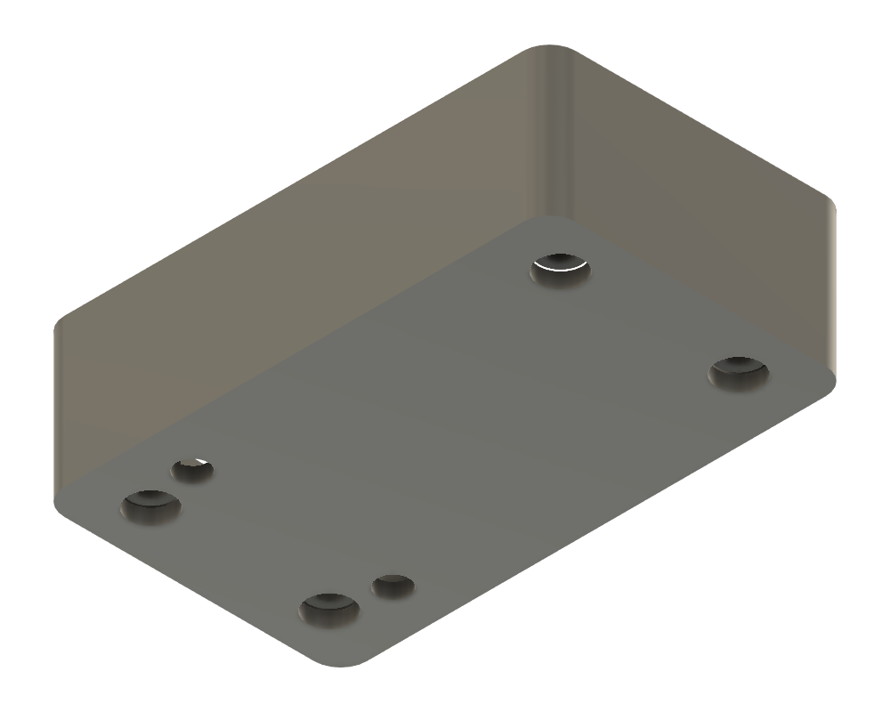

# 3D-printable case — ESP32-S3-Touch-LCD-1.47 (SB20 head-unit)

A two-part case for the Waveshare **ESP32-S3-Touch-LCD-1.47** board (the S3 head-unit, `esp32s3-pio*`
firmware), **designed against Waveshare's official STEP model** (`board-reference/`). Parametric
generator + STLs here.

## Dimensions — all from the STEP (no more guessing)
| | Value |
|---|---|
| PCB | **24.06 × 44.01 × 1.2 mm** (`BOARD` body) |
| 4× M2 holes / H4 brass standoffs | **(±8.50, ±19.50)** from centre — near the ends |
| Display module | 19.4 × 36.8, centre offset **−1.2 mm** in Y; active area 17.39 × 32.35 |
| Rear header pins | **~9 mm** below the PCB back, both long edges (x ≈ ±8.9, y ∈ [−10.9, 17.0]) |
| BOOT / RST switches | **(±9.56, −14.50)**, on the **back** face (actuate toward −Z) |

*(Earlier versions used the 2D drawing and got the length wrong — 39 mm vs the real 44 — and the hole Y
off by 7 mm. The STEP fixed both.)*

## How it mounts
- Board sits **back-down**; its 4 mm standoffs land on **four printed 4 mm pillars** (slim, to clear the
  side-edge headers), so it floats **9 mm** off the floor and the rear pins hang **enclosed** between them.
- **M2 button-head screw from OUTSIDE the case back** (counterbored flush), up through each pillar into
  the female standoff. ~**M2 × 8**, ×4.
- **BOOT/RST** actuate off the back, so there's a **hole through the floor** under each (poke with a tool,
  or drop in a printed plunger) — see the underside render.
- The **bezel** press-fits into the front, two-level window (recess clears the raised glass, opening
  exposes just the active area).

Enclosing the 9 mm pins makes the case ~**14 mm** thick. **To slim it right down:** cut/omit the breakout
headers and set `header_clear≈2` in `generate_case.py` — the case drops to ~7 mm.

## Regenerate / simulate fit
Fusion 360 → **Scripts and Add-Ins ▸ Scripts ▸ +** → [`generate_case.py`](generate_case.py) → Run
(builds `Case_Back` + `Bezel_Front`, auto-exports both STLs). To **simulate the real fit**: import the
STEP (`board-reference/`) into a Fusion assembly and drop the case bodies around it — scope any cut
features to the case body only, or they'll carve the board too.

## Print
PLA/PETG, 0.2 mm, 3 perimeters. Tray open-side up, bezel window-down (no supports). Tune `fit`/`bez_fit`
for the board slip fit and `pillar_od`/`m2_clear` for the standoff + screw. Print the **bezel first** as a
cheap fit-check.

## Left for the real board / a test print
- Confirm BOOT/RST really actuate off the back (STEP says so) — if side-actuated, switch to wall slots.
- Verify the slim pillars clear the header pins, and the bezel fit.
