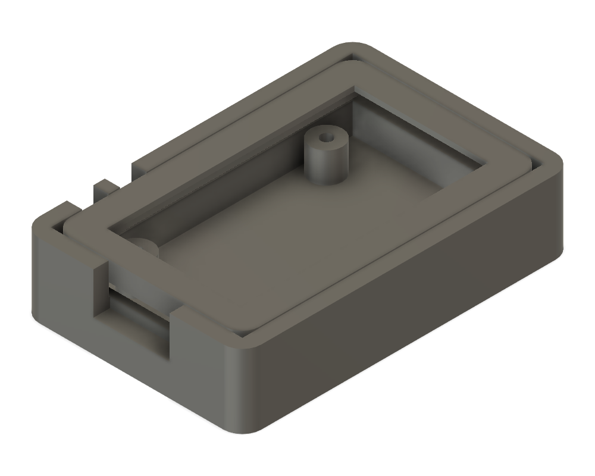
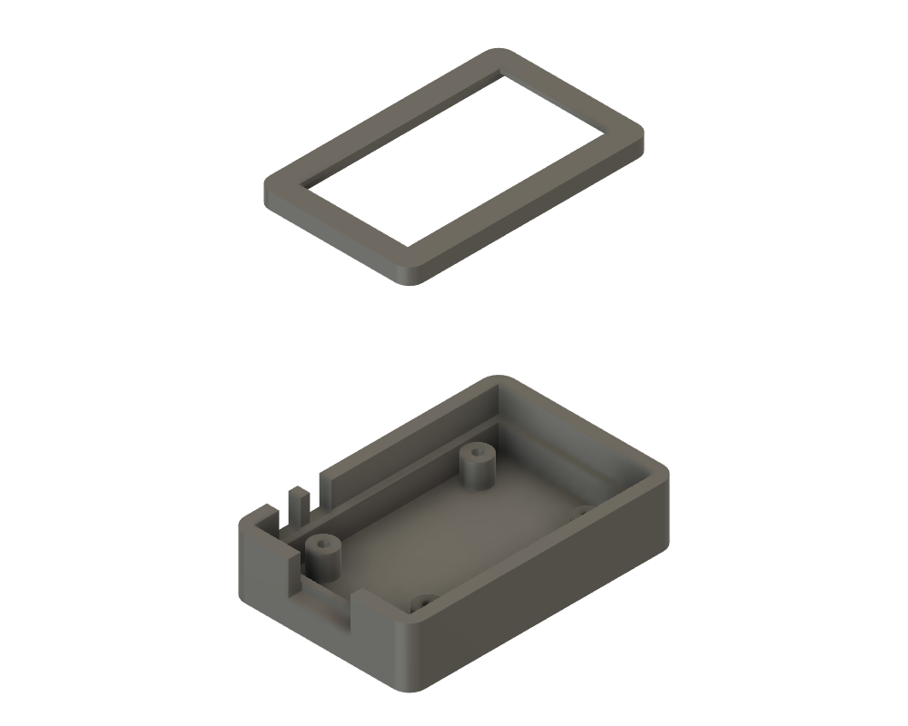

# 3D-printable case — ESP32-S3-Touch-LCD-1.47 (SB20 head-unit)

A two-part case for the Waveshare **ESP32-S3-Touch-LCD-1.47** board (the S3 head-unit, `esp32s3-pio*`
firmware). Designed in Fusion 360; parametric generator + STLs here.

## Parts
- **`SB20_S3_case_back.stl`** — the tray: a perimeter shelf **+ four M2 screw bosses** so the board
  **screws down onto the case** through its own mounting holes; a back-component cavity; an **open-top
  USB-C notch**; and two **side button slots** (prints without bridging).
- **`SB20_S3_case_bezel.stl`** — the front frame: press-fits into the tray, **two-level window** (an
  underside recess clears the raised display glass, the top opening exposes just the **active area**).

## What's grounded vs. what to verify
Dimensions came from the Waveshare mechanical drawing (via a browser — the wiki blocks scripted fetch)
and the LCD datasheet:

| Value | Source | Confidence |
|---|---|---|
| Display **active area 17.39 × 32.35 mm**, module 19.39 × 36.28 × 1.46 | LBS147TC-IF15 datasheet | **exact** |
| **PCB ≈ 24.5 × 39 × 1.6 mm** | Waveshare drawing | good — **caliper to confirm** |
| **4× M2 mounting holes** — top pair 17.78 mm apart, bottom pair 17.00 mm, 25.40 mm vertical | Waveshare drawing | good — confirm XY |
| USB-C on the **top edge** (by the 17.78 pair) | drawing + product photo | good |
| **Button (BOOT/RESET) positions** | *not dimensioned in the drawing* | **guess — must verify** |

So before a full print: **caliper the PCB and the button locations**, then edit `P{}` in
[`generate_case.py`](generate_case.py) and re-run. The M2 hole XY (`hx_top/hx_bot/hy`), the display offset
(`lcd_off_y`), and the buttons (`btn1_y/btn2_y/btn_on`) are the ones most worth checking.

## Using the mounting holes
The 4 bosses have **1.5 mm pilot holes** — drive an **M2 self-tapping screw** from the front through the
PCB's mounting holes into each boss (or drill the boss to 1.6 mm). This retains the board solidly; the
bezel then just press-fits and frames the display. Boss OD 4.2 mm, height = the cavity depth.

## Regenerate
Fusion 360 → **Utilities ▸ Scripts and Add-Ins ▸ Scripts ▸ +** → add [`generate_case.py`](generate_case.py)
→ Run. It builds `Case_Back` + `Bezel_Front` **and auto-exports both STLs** to this folder.

## Print
- **PLA or PETG**, 0.2 mm layers, 3 perimeters, 15–20 % infill.
- **Tray** open-side up (no supports — the USB + button openings are open slots).
- **Bezel** window-side **down** on the bed (no supports).
- Tune `fit`/`bez_fit` (0.1 mm steps) if the bezel is tight or the board rattles.

## Still to do / not verified on a real print
- **Buttons are a guess** — confirm which edge and the exact Y before trusting the slots (or add printed
  button extenders once known).
- No bike-mount yet (bar clamp / strap slots / quarter-turn) — easy to add to the tray back.
- Print the **bezel first** as a cheap fit-check against the board before committing to the tray.
