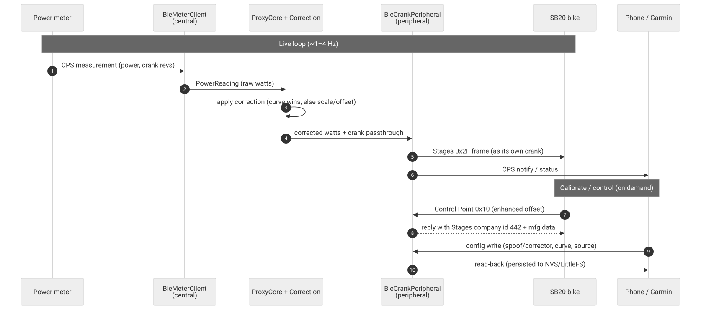

# Architecture — SB20-power-proxy

**One idea, in one sentence:** *read a power meter → correct its reading → re-broadcast it so a
consumer accepts it as its own.* The primary consumer is a **Stages SB20 smart bike**, which only runs
its erg loop off *its own* crank — so the on-bike firmware **impersonates that crank** (byte-faithful
Stages framing) and feeds it a third-party meter (a Favero Assioma). The same core also runs as an honest
**meter-to-meter corrector** for any head unit.

> This doc is the *conceptual map*. The authoritative inventories are
> [`PROJECT-MAP.md`](../PROJECT-MAP.md) (capabilities built), [`code/findings/decisions.md`](../code/findings/decisions.md)
> (append-only log of every decision/measurement), and [`BOARDS.md`](../BOARDS.md) (the physical boards).
> Diagram sources live beside their SVGs in [`docs/diagrams/`](diagrams/) — rendered locally (see the
> **Diagrams** convention in [`CLAUDE.md`](../CLAUDE.md)).

## 1. System overview

Three implementations of the *same* flow — **`source → correction → target`** — each with hardware behind
a seam so the logic is host-testable without a radio:

- **`firmware/`** — the on-device runtime (**ESP32-C3**, BLE + WiFi): the primary product.
- **`firmware-nrf/`** — the **nRF52840** "Bridge" (BLE-only; its GATT service *is* the control surface).
- **`code/`** — Python desk tooling: the same core over **ANT+**, plus capture/fit/replay/ride.

Two **product modes** (same core, different identity + correction):
1. **SB20 crank spoof** — *must* impersonate `Stages 62144` (the `0x2F` Stages frame, the Stages
   DIS/CP-Feature/proprietary service, and the `0x10` calibrate reply with company id **442**), because the
   SB20 only accepts its own crank.
2. **Meter-to-meter corrector** — our own honest CPS identity; any head unit accepts a plain CPS meter.

## 2. The proxy core — the spine

The heart is small and pure. A `ProxyCore` wires a **source** to a **target** through a **correction**,
with the radio abstracted behind interfaces (`IPowerSource` / `ICrankOutput`) so a `MockMeter`/`MockCrank`
(or a captured JSONL replay) stands in for hardware in unit tests. The correction is either a scalar
scale/offset or a **fitted power→factor curve** (the curve wins when present) — the same math shared by
firmware and the Python fitter.

**Why it's shaped this way:** the only files that need a board are the seam classes
(`ble/BleMeterClient`, `ble/BleCrankPeripheral`, `net/WifiLink`, `disp/`). Everything else — the CPS codec
(`Cps.h`), the correction (`Correction.h`), the wiring (`ProxyCore.h`), the calibration fit
(`CalibrationSession.h`), the workout/erg runtime — compiles and is unit-tested on the host. Only the final
on-air / pairing check is manual.

## 3. Firmware — two MCUs, pure-core + hardware-seam

| | **ESP32-C3** (`firmware/`) | **nRF52840** (`firmware-nrf/`) |
|---|---|---|
| Pure core | `lib/proxy/` (ProxyCore, Correction, Cps, Workout, Calibration, Obc…) | `lib/bridge/` (`Proto.h`, `AntBikePower.h`, `ImuCapture.h`) |
| Hardware seam | `src/ble/*`, `src/net/WifiLink`, `src/disp/*`, `src/ui/LvglUi` | `src/BridgeService`, `src/BridgeConfigStore`, `src/main.cpp` |
| Control surface | **WiFi**: HTTP + the shared Web SPA at `/app`; captive portal | **BLE**: the custom **Bridge GATT** (Web Bluetooth + Garmin Connect IQ) |
| Extras | Head-unit displays (OLED / LVGL), FTMS erg, OTA | On-device IMU capture, ANT+ spoof (S340-gated) |

**Build flavours** (`platformio.ini` envs): mock-meter (ramp) vs `*-live` (reads a real meter); ± display;
± OTA. The head-unit displays are LVGL on the colour panels (`esp32cyd`, `esp32s3-pio`) and a thin U8g2
seam on the OLEDs (`esp32c3-oled` = 0.42" 72×40, `esp32c3-oled96` = 0.96" 128×64). The physical boards,
their MACs, and their quirks are catalogued in [`BOARDS.md`](../BOARDS.md).

## 4. Provisioning + control surfaces

The ESP32 boards provision over WiFi via a **captive setup portal** — a per-device `Setup-XXXX` AP (the
suffix is the last two MAC bytes, so it's a fingerprint and multiple boards don't collide). On the C3's
single 2.4 GHz radio, BLE is held **off** while any portal is up and the STA side is quiesced, so the
softAP can actually beacon:

The **shared Web SPA** (`web/index.html`) is one file that talks either transport: **Web Bluetooth** to the
nRF Bridge GATT, or **HTTP** to the ESP32 — the same UI, capability-gated per device (e.g. the ESP32 hides
the scalar scale/offset because its correction is a curve).

## 5. The shared wire contract — one schema, many mirrors

The Bridge packet layouts + capability flags + button-action order are one logical contract that used to
be hand-copied into four languages (C++ `Proto.h`, the SPA's JS, Garmin Monkey-C, the ESP32 JSON). A single
**`ui-schema/bridge.json`** now generates the drift-prone mirrors, and everyone is **locked together by
committed golden vectors** that both a C++ test and a Node test assert against in CI. A sibling
**`ui-schema/web-json.json`** does the same for the ESP32↔SPA status/config JSON (`WebJson.h`), guarded as a
contract linter so the on-device serializers can't drift from the web UI:

## 6. The real-data pipeline (the spine of the method)

Nothing is built ahead of the capture that grounds it. On-bike **captures** (committed JSONL in
`code/findings/captures/`) → **codecs/fixtures** (golden-vector tests) → **fit** a correction
(`calibration.py`, from paired captures) → **deploy** into the firmware `Correction`. The Python
`sb20proxy` package mirrors the firmware flow over ANT+ (`core.py`, `ble/cps.py` = the twin of `Cps.h`,
`ant/` masters + page codecs, `twins/` in-process fakes) so the whole proxy is hermetically testable, and
the numbered `scripts/` are the capture/fit/replay/proxy entry points.

## 7. Testing discipline (the invariants)

- **Real-data-first:** fixtures come from real committed captures, never invented bytes.
- **Test the desk-testable in the same commit:** codecs, correction, `ProxyCore` wiring, calibration, and
  the wire formats ship with `pytest` / `pio test -e native` in the same change. CI runs the ESP32 native
  core suite, the nRF native wire-format suite, the Python suite, and the `bridge-parity` (schema↔C++↔JS
  golden) job.
- **Even the on-device UI is host-tested:** `pio test -e native-lvgl` compiles the real `src/ui/LvglUi.cpp`
  on the host and renders it into an in-memory framebuffer through the `LvglDriverHooks` seam — asserting
  both pixels *and* tap→`UiAction` — so the LVGL head-unit UI that ships on the ride boards has desk
  coverage, not just the canvas reference renderer.
- **Hardware behind a seam:** an injectable radio / `FakeRadio` unit-tests the logic; only the final
  on-air / pairing check is manual. Nothing replaces hardware testing against a real SB20.
