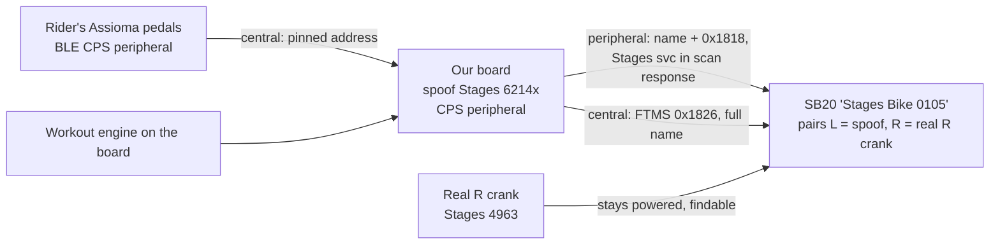
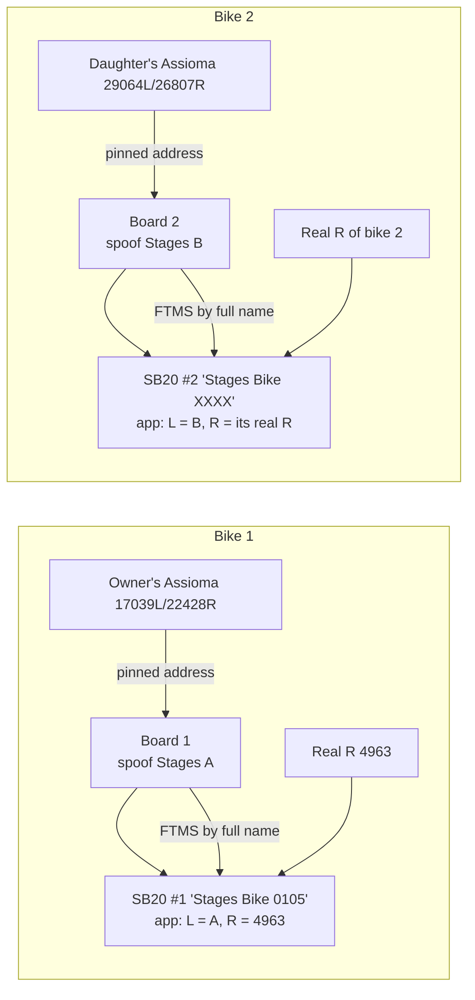
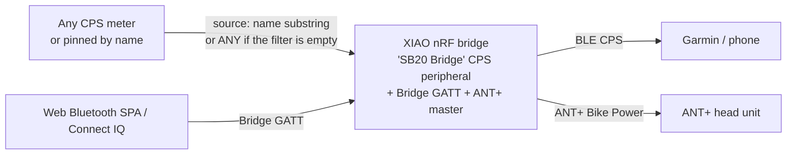
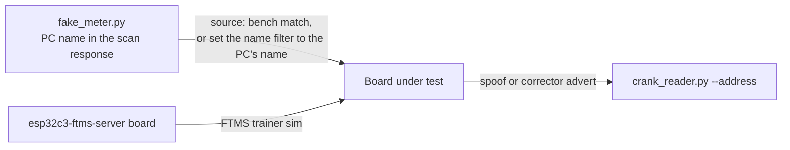

# System reference — how the pieces are meant to fit at runtime

**Status: LIVING (first cut 2026-09-23, issue #290).** `PROJECT-MAP.md` says what *exists* and
`code/findings/` says what was *measured*; this doc says how the parts are **supposed to behave
together at runtime**: which board plays which role, who connects to whom and how they find each
other, what each mode changes, which combinations are legal, and what you should expect to see when
a board is powered on. It is written for the two-bike training stack (`ROADMAP.md` north star) and
it is honest about what is *not yet established* (§11). Every rule cites the code or the measurement
it comes from; if the code changes, change the rule here in the same PR (§12).

**The 10-minute test:** a new agent, or a returning human, reads this and can predict what happens
when a given board is powered on in a given mode next to a given bike. If a session doc wants to
*assert* a topology rather than discover it, it writes an expected-topology card (§0) from §9.

## 0. How to use this doc, and the expected-topology card

Before any gate of a physical session, write one card per gate:

```
Gate: <name>            Boards powered: <list; everything else OFF>
Bike(s): <name/addr>    Rider(s) + pedals: <BLE names or addresses>
Expected links:  <board> --central--> <peer>   (by: name substring / address / CPS UUID)
                 <consumer> --central--> <board or bike>
Must be unique:  spoof names, pinned pedal addresses, trainer names (§7)
/status must show: source=<…> trainer=<…> identity=<…>   /log line: <…>
Not powered:     <bench/mock builds, spare boards, the nRF, the second bike's board …>
```

If the card cannot be filled from §5–§9, the gap is a §11 item: run the cheap experiment first.

## 1. The one model

Everything is **source → correction → target** behind a hardware seam (`docs/architecture.md`):

- A **source** is a BLE Cycling Power Service peripheral we subscribe to as a *central* (a power
  meter, or a real crank).
- The **target** is what we advertise as a *peripheral*: in **spoof** mode a Stages crank (so the SB20
  runs its erg loop off the pedals), in **corrector** mode our own honest CPS identity (so any head unit
  reads corrected power).
- The **loop guard**: we never read a device whose advertised name equals our own spoof name
  (`firmware/lib/proxy/MeterMatch.h`, path 1), because reading our own advert would form a loop.

An ESP32 head unit can open up to **four centrals** at once from one shared scan hub: the source
meter, the calibration reference meter, the FTMS trainer it erg-drives, and the SB20 as a shifter
(button) source (`firmware/src/main.cpp`; the nRF has the same four roles, `firmware-nrf/lib/bridge/PeerRole.h`).

## 2. Boards and roles (the fleet as of 2026-09-23)

| Board | Identity / address | Role in the two-bike stack | Notes |
|---|---|---|---|
| **C3-OLED** (`sb20proxy.local`, `192.168.1.165`) | spoof `Stages 62145` (renamed from `62144` in session 8; confirm on `/status`) | bike 1's proven spoof board for the first rides | the only board that has ridden; 30-min ride-ready soak passed 2026-09-23 |
| **Guition JC3248W535** (`sb20proxy-guition.local`, `192.168.1.222`) | was `Stages 62145` on 2026-09-23 — **collides with the C3**; rename before both are powered | the head unit for each bike (a second one to be ordered; #332) | validated on a simulated meter; never ridden; not compiled in CI (#323) |
| **CYD** (`sb20proxy-cyd.local`, `192.168.1.234`) | `Stages 62144` on pre-#330 firmware (session 13 G0) — **collided with bike 1's real crank**; from #330 a blank identity derives `Stages 92364` (predicted from its `Setup-CC8C` suffix; confirm on `/status`) | fallback head unit | session 13 G0 found it spoofing the real crank |
| **Waveshare S3-Touch** (`sb20proxy-s3.local`) | (check `/status`) | fallback head unit | OTA-deaf to espota; USB flash |
| **XIAO nRF52840 Sense** (BLE `DE:F2:ED:C4:F3:FD`) | corrector `SB20 Bridge`, or spoof `Stages 62144` when in spoof mode | not in the two-bike stack (track bike, ANT+) | must be **off** during two-bike rides unless deliberately part of a gate |
| **nRF52840 USB dongle** (`1915:522A`) | — | the BLE sniffer (`code/scripts/sniff_ble.py`) | start it *before* a connection you want to see (session 6) |
| **ANT+ stick** (`0FCF:1008`) | — | the Python ANT+ tooling; sees every ANT+ device in the room | Linux/WSL udev rule needed |
| **The bike laptop** | — | runs every tool during a session; the rider only touches hardware and pedals | `tools\doctor.ps1` is the pre-flight |
| **Bench camera** (UC70) | — | sees what a panel shows without a human | recipe in `BOARDS.md` |

The physical inventory with MACs, ports and quirks is `BOARDS.md`; the fleet-identity table (board →
identity → bike → pinned pedals → trainer name) is ROADMAP Now item IDENT (#330) and lives here.

**Default-identity rule (shipped by #330):** a board with *no stored* identity advertises
`Stages 9NNNN`, where `NNNN` = the last 16 bits of its **base MAC** modulo 10000, zero-padded
(`firmware/lib/proxy/FleetIdentity.h::defaultSpoofName`, applied at boot by
`RuntimeConfig::resolveIdentity`; Python twin `sb20proxy.qa.acceptance.default_spoof_name`). Those are
the same two MAC bytes as the board's `Setup-XXXX` SSID, so `Setup-A6E9` ⇒ `Stages 92729`, and the
base MAC is what `esptool read-mac` and `BOARDS.md` print. A *stored* identity (set in `/setup` or
`POST /config`; blank = the default) is used exactly as saved, including a deliberate real-crank id
for a crank rescue. `/status` reports `identity` plus `identity_default` (true = derived, nothing
stored), and the boot log prints `[cfg] identity '…' (derived from this board's MAC…|stored)`.
Predicted defaults from the `BOARDS.md` base MACs (confirm each on `/status` before it rides):
S3-Touch `A4:CB:8F:DA:E9:CC` ⇒ `Stages 99852`; the 0.96" C3 `10:B4:1D:BA:C9:0C` ⇒ `Stages 91468`; the
CYD (`Setup-CC8C`) ⇒ `Stages 92364`. **The `9xxxx` ids are an assumption** — only `62145` is proven to
pair with the Stages app (§11).


| Board | Spoof identity | Bike | Pinned pedals (`meterAddress`) | Trainer name (`trainerNameFilter`) |
|---|---|---|---|---|
| C3-OLED `.165` | `Stages 62145` (to confirm) | SB20 #1 | owner's `ASSIOMA 17039L` address | `Stages Bike 0105` |
| Guition #1 | its MAC-derived default (read it off `/status`), or assign — never `62144`/`62145`/`4963` | SB20 #2 | daughter's `ASSIOMA 29064L` address | SB20 #2's full name (G0 inventory) |
| Guition #2 | its MAC-derived default, or assign | SB20 #1 (replaces the C3 as head unit) | owner's address | `Stages Bike 0105` |
| CYD, S3 | predicted defaults `Stages 92364` / `Stages 99852` (confirm on `/status`) | none | — | — |
| nRF | its own fixed spoof profile (`Stages 62144` in spoof mode — keep it OFF near bike 1) | none | — | — |

## 3. The SB20 as a BLE device

- The bike advertises as **`Stages Bike 0105`** at `E4:AA:5A:D6:0E:D4` (bike 1) with the standard
  **FTMS** service `0x1826`, **CSC** `0x1816` and the Stages vendor service `0c46be5f` whose
  characteristic `0c46be60` carries the **handlebar buttons** (`code/findings/shifter-ble-protocol.md`).
  Some scans also show an unnamed advert from the bike; do not rely on the name being present in
  every packet (§11).
- The **Stages app** talks to the bike over the proprietary `0c46be` channel in cleartext (session 6);
  **qz** drives erg over standard FTMS (session 7). Both are *consumers* of the bike.
- The bike's **crank link** is BLE when "Pair with Bluetooth" is on in the app, otherwise the bike's
  internal ANT+ link (`code/findings/sb20-hardware-reference.md`). Our spoof is a BLE crank.
- **Erg is gated on a working crank**: the SB20 will not run its erg loop unless it can see its
  configured crank(s). The app's pairing screen needs **both** crank ids findable: absent L *or* R and
  pairing fails; both present and it connects (session 9; refines session 8). Hence the recipe: **app L
  = our spoof, R = that bike's real right crank**, and the real R crank stays powered. The bike then
  consumes only the spoof's (doubled-left) total; no double count (session 8).
- The bike's own telemetry (`0x2AD2` Indoor Bike Data, CSC) can come up **degraded** on a cold start
  and stay so until the Stages app connects once; the cause is not established (#288, session 13).
  The healthy `0x2AD2` flag set is `0x00c5`; the degraded frame is `0x0011`.

## 4. Our device: what each mode changes

`RuntimeConfig` (`firmware/lib/proxy/RuntimeConfig.h`) carries: `mode` (Spoof | Corrector),
`spoofName` (no compile-time default: blank = derived per board from its MAC at boot —
`FleetIdentity.h`, `RuntimeConfig::resolveIdentity`; `/status` `identity_default` says which), `spoofSerial`, `meterAddress` (pin the source),
`meterNameFilter` (default `ASSIOMA`), `singleSidedDouble`, the corrector's `refMeterAddress` /
`refMeterNameFilter` / `curve` / `calibrating`, `trainerNameFilter` (`""` = erg off), and the OBC
flags `obcEnabled`, `obcDevmode`, `obcSinkShifter`, `obcPort`, `obcButtons`. All are set from
`/setup` or the shared SPA and persist in NVS (a versioned line, `v2|…`).

| Mode / flag | Advertised name | Primary advert | Scan response | Services exposed | Centrals opened |
|---|---|---|---|---|---|
| **Spoof** (default) | `spoofName` | name + CPS `0x1818` | the Stages proprietary service `d445fe01` | CPS, DIS (Stages Cycling / SPM2 / fw / serial), Battery `180F`, the Stages service | 1: the source meter |
| **Corrector** | `spoofName` (our own honest name) | name + CPS `0x1818` | none | CPS, DIS (our own), Battery | 1: the source (DUT) |
| **Corrector + calibrating** | as above | as above | none | as above | 2: DUT + the reference meter; the erg client is skipped while calibrating |
| **+ trainer configured** (`trainerNameFilter` non-empty) | unchanged | unchanged | unchanged | unchanged | +1: the FTMS trainer (erg drive from the workout engine) |
| **+ OBC enabled** (`obcEnabled`) | unchanged | unchanged | unchanged | + the OBC BLE service (and mDNS/TCP on `obcPort` on the ESP32) | unchanged |
| **+ OBC devmode** (`obcDevmode`) | **`OBC-SB20`** (fixed string) | name + CPS | as per mode | + OBC service | unchanged; `GET /obc/press` fires virtual buttons |
| **+ shifter sink** (`obcSinkShifter`) | unchanged | unchanged | unchanged | + OBC service | +1: the SB20 (by name `Stages Bike`), to read `0c46be60` and re-broadcast as OBC |
| **Setup portal up** (fresh onboarding or a failed WiFi join) | **nothing** — BLE is held off | — | — | — | none; the portal serves only its own pages (`/`, `/rescan`, `/save`, `/forget`, `/log`); `/setup` and `/wifi/off` are station routes, reachable once WiFi is up; BLE starts after provisioning (`main.cpp`, the portal gate) |
| **Ride-mode WiFi-off** | unchanged | unchanged | unchanged | unchanged | unchanged; HTTP is unreachable until reboot |
| **Mock / bench build** (`USE_MOCK_METER=1` or `METER_MATCH_ANY_CPS=1`) | `spoofName` | as per mode | as per mode | as per mode | mock: no source at all (a ramp); bench: the *nearest* CPS advertiser that is not a `Stages ` crank. **Never power one in the room during a ride** (`flash.ps1` refuses these envs without `-Force`) |

Sources: `firmware/src/ble/BleCrankPeripheral.cpp` (`begin()`: the DIS, Stages and Battery services,
the advert/scan-response split "exactly like the real crank", the `OBC-SB20` devmode name),
`firmware/src/main.cpp` (`shifterBegin`, `ergBegin`, the portal gate that holds BLE off).

## 5. Discovery: who finds whom, by what

| Link | Opened by | Finds the peer by | Code | Consequence for two bikes |
|---|---|---|---|---|
| Our board → source meter | our central | `MeterMatch::isTargetMeter`: (1) never our own `spoofName`; (2) if `meterAddress` is pinned, **that address only**; (3) a nameless advertiser by the CPS UUID; (4) bench only: any CPS advertiser that is not a `Stages ` crank; (5) a named advertiser whose name **contains** `meterNameFilter` | `firmware/lib/proxy/MeterMatch.h` | `ASSIOMA` matches both riders' pedals: **pin by address** on every board |
| Our board → FTMS trainer (the bike, for erg) | our central | an FTMS `0x1826` advertiser whose name **contains** `trainerNameFilter` | `firmware/src/ble/FtmsErgClient.h` (`want_`) | `Stages Bike` matches both bikes: use the **full name** per board |
| Our board → SB20 buttons (shifter sink) | our central | an advertiser whose name contains `"Stages Bike"` (hard-coded) | `firmware/src/main.cpp` `shifter.beginShared("Stages Bike")` | matches both bikes; address pinning is ROADMAP Next |
| SB20 → its crank(s) | the bike's central | the crank ids typed into the Stages app ↔ the advertised `Stages <id>` names (sufficient in sessions 8/9; whether the DIS serial also matters is §11) | sessions 8, 9 | every `Stages NNNNN` in the room must be unique (§7) |
| The Stages app → the bike | phone central | the bike's advertised name / the app's pairing list | session 6 | one phone, two bikes: §11 |
| qz → the bike | qz central | the bike's advertised name (FTMS) | session 7 | qz must not drive erg while a head unit does (§6) |
| qz → our OBC producer | qz central | an `OBC-` **name prefix** (fork `bfb84695f`), or the OBC service UUID | session 13 | `OBC-SB20` is one fixed string: at most one devmode board in the room |
| nRF bridge → its four peers | nRF central | the role ladder, by **name substring**: an established source link stays Source; else Trainer if configured and free; else Reference if calibrating and the name matches the reference filter but not the source filter; else SB20 if the shifter sink is on; else **Source, and an empty source filter accepts any CPS advertiser** | `firmware-nrf/lib/bridge/PeerRole.h` `classifyByName` | an empty-filter nRF in the room latches the nearest CPS advertiser, including our own spoof (decisions 2026-07-27) |
| The Python tooling → anything | laptop | `crank_reader.py` by name or `--address`; `fake_meter.py` advertises CPS with the PC's name in the scan response | `code/scripts/` | two boards on one identity made `--address` mandatory (decisions 2026-09-23) |

## 6. Ordering constraints (the non-obvious ones)

1. **A BLE peripheral in a connection stops advertising.** Anything that must *discover* the SB20 has to
   attach before another central takes it. This is the discovery-ordering deadlock: the C3 finds the
   SB20 by advertised name; once qz connects, the bike stops advertising and the C3 never finds it
   (#291, session 13 G2). It also means **board before app** for our own spoof: bring our board up,
   *then* open the Stages app (session 13 R5).
2. **One consumer per peripheral.** The SB20 will not serve the same role to two centrals; the nRF and
   the C3 **cannot both serve OBC** to qz (reproduced twice, session 13).
3. **Never two erg controllers on one bike.** When the head unit's workout engine drives erg
   (`trainerNameFilter` set), qz must not also control the bike, and vice versa. Set
   `trainerNameFilter` empty (erg off) on a qz/Peloton day.
4. **Reply before zero.** On a control-point write the reply goes to the SB20 *before* the zero is
   forwarded to the pedals; an unanswered write drops the link (reason 531) and the Assioma's zero takes
   ~3.6 s (`firmware/lib/proxy/CpApply.h`, R10a).
5. **Both crank ids findable** before the app will pair (§3).
6. **BLE is held off while the setup portal is up**; provisioning ends in a reboot (`main.cpp`).
7. **Sniff before connect.** A sniff started after the connection sees only adverts (session 6).
8. **The Stages-app "wake"** of degraded telemetry is a hypothesis, not a rule (#288): treat a dead
   `0x2AD2` stream on a cold start as a known failure mode with an open cause.
9. **Ride-mode WiFi-off** removes HTTP until reboot; capture what you need first.

## 7. Legal and illegal configurations, including the two-bike matrix

**Per bike, the tuple that must be consistent:** {the SB20's name and address, its real L and R crank
ids, the spoof id of its board, the head unit, the rider's pedal set (BLE names and addresses, ANT+
ids), the trainer full name in that board's config, the phone that holds the app pairing}.

**Must be unique room-wide:**

| Thing | Why | Where it is set |
|---|---|---|
| every `Stages NNNNN` name (2 spoofs + 4 real cranks) | the SB20 pairs by advertised name; a duplicate can bind a bike to an unfed spoof (0 W) or refuse pairing | `/setup` identity; `spoofName` (blank = the board's MAC-derived `Stages 9NNNN`, unique per board); `qa_board.py` fails a duplicate or a real-crank id |
| the pinned pedal address per board | `ASSIOMA` matches both sets | `/setup` source → `meterAddress` |
| the trainer name per board | `Stages Bike` matches both bikes | `/setup` trainer → `trainerNameFilter` (full name) |
| mDNS hostnames | already per board (`sb20proxy`, `-cyd`, `-s3`, `-guition`) | firmware, by board |
| setup-AP SSIDs | already MAC-derived (`Setup-XXXX`) | `SetupPin.h` |
| the OBC devmode name | `OBC-SB20` is fixed, so only one board may run devmode | `obcDevmode` |

**ANT+:** the SB20's internal ANT+ crank link and the Python tooling both address devices by number;
two bikes with distinct crank ids are *expected* to coexist, but this has not been measured with two
SB20s in one room (§11). The ANT+ stick sees everything: the Assioma sets (owner 17039, daughter
29064), both bikes' FE-C channels, the cranks.

**Illegal (will fail or corrupt a ride):**
- The same spoof name on two boards, or a board advertising `Stages 62144` / `Stages 4963` next to bike 1
  (pre-#330 firmware's default, or a crank-rescue configuration on the wrong bike). `qa_board.py` fails both.
- A bench (`METER_MATCH_ANY_CPS`) or mock (`USE_MOCK_METER`) build powered in the room: the bench
  build reads the nearest meter, the mock build advertises ramping watts.
- qz's native SB20 button decode and the OBC listener both on (double-fire, session 13 R1).
- Two OBC consumers on one producer; two OBC producers (nRF + C3) for one consumer.
- Two erg controllers on one bike (§6.3).
- A Garmin paired to the bike over the trainer protocol during a ride (suspected cause of #288; unpair
  until G1b of session 14 settles it).
- An empty-filter nRF bridge powered on during a ride (it latches the nearest CPS advertiser).

**What a default-identity boot does (from #330):** a fresh or `--erase-nvs` board — or one whose
`/setup` crank name was saved blank — advertises its MAC-derived `Stages 9NNNN` (§2 rule) with
`ASSIOMA` as its source filter and no trainer; `/status` reports `identity_default: true`, `source_pin`,
`source_filter` and `trainer`, and the boot log says `[cfg] identity '…' (derived from this board's
MAC: nothing stored)`. It cannot collide with bike 1's real cranks or with another board, but it still
reads the first `ASSIOMA` it sees and any empty-filter bridge in range may read it as a source — so
**pin the pedals and set the trainer's full name in `/setup` before a two-bike ride**. Pre-#330 firmware
boots as `Stages 62144`: reflash it, or store an identity, before powering such a board near bike 1.
The acceptance card (`qa_board.py`) fails a board advertising `62144`/`4963` unless `--crank-rescue`
says that is intended, and fails two advertisers on one name.

## 8. Topologies

### 8a. One bike, spoof ride, head-unit erg (the session-14 G1–G3 shape)


Expected: the board's `/status` shows the pinned source connected, the trainer connected, identity =
the fleet-table name; the bike shows the pedals' watts; erg targets from the board move the resistance.

### 8b. Two bikes, two riders, one room (the session-14 G5 shape)


Every edge is by address or full name; A ≠ B ≠ 62144 ≠ 4963 ≠ bike 2's crank ids. Nothing else that
speaks CPS or OBC is powered.

### 8c. OBC via the C3 with qz as the consumer (the #291 deadlock)

```mermaid
sequenceDiagram
  participant SB as SB20 (peripheral)
  participant C3 as C3 shifter sink (central to SB20; OBC producer)
  participant QZ as qz (central to SB20 and to the C3)
  Note over C3: hunts "Stages Bike" by advertised name
  QZ->>SB: connect (FTMS erg + telemetry)
  Note over SB: stops advertising while connected
  C3-->>SB: never finds it (no advert)
  Note over C3,QZ: buttons never reach OBC. Attach the C3 first, or pin by address, or let the board proxy everything (#291).
```

### 8d. The nRF bridge standalone (track bike, corrector mode)



### 8e. The bench (no bike)


Two boards on one identity make `crank_reader --address` mandatory (decisions 2026-09-23).

## 9. Predict what happens: board × mode

| Board / build | Advertised name | Services in advert / scan response | Centrals it opens | Who may connect to it | `/status` says |
|---|---|---|---|---|---|
| ESP32, spoof (default config, no trainer) | `spoofName` (blank = the MAC-derived `Stages 9NNNN`) | `0x1818` primary; Stages `d445fe01` in the scan response | source meter (filter `ASSIOMA`, or a pinned address) | one SB20 (or `crank_reader`) | `mode: spoof`, `identity` + `identity_default`, `source_pin` / `source_filter`, `trainer` empty |
| ESP32, spoof + trainer | as above | as above | source + FTMS trainer by name | the SB20 | + trainer connected, erg target |
| ESP32, corrector | our own name | `0x1818` primary, no scan response | DUT source | any head unit (Garmin, phone) | `mode: corrector`, curve present or not |
| ESP32, corrector + calibrating | as above | as above | DUT + reference | as above | calibration state (Idle / Collecting / Fitted) |
| ESP32, OBC devmode | `OBC-SB20` | `0x1818` + OBC service | as per mode | an OBC consumer (qz, `obc_reader.py`) | OBC enabled, devmode |
| ESP32, shifter sink | as per mode | + OBC service | + the SB20 (`Stages Bike`) | an OBC consumer | shifter central state |
| ESP32 in the setup portal | nothing (BLE off) | — | none | the phone on `Setup-XXXX` → `172.29.4.1` | portal page, not `/status` |
| ESP32 mock build (`esp32c3-supermini` etc.) | `spoofName` | as per mode | none (a ramp) | anything that pairs to a crank — **never near a bike** | ramping watts |
| ESP32 bench build (`*-bench`) | `spoofName` | as per mode | the nearest non-Stages CPS advertiser | as above | whatever it latched |
| Guition / CYD / S3 | same as the C3 for the same config, plus the LVGL UI and their own hostnames | | | | |
| nRF corrector | `SB20 Bridge` | `0x1818` only (no OBC UUID as shipped: session 13 R9) | up to four by the role ladder | Garmin/phone; the Web Bluetooth SPA; Connect IQ | serial only (no HTTP) |
| nRF spoof | `Stages 62144` (its own fixed spoof profile) | as the ESP32 spoof | as above | an SB20 (never tried: R3) | serial |
| `03_static_replay.py --radio ant` | ANT+ device 62144, type 0x0B | — | — | an ANT+ consumer (the SB20's internal link, a head unit) | — |
| `fake_meter.py` | the PC's name (WinRT stamps it) | `0x1818` | — | our boards (bench match or a name filter set to the PC's name) | `subs=1` in its log when a board is attached |

## 10. Instruments per board

ESP32 boards: `/status` (JSON: mode, `identity` + `identity_default`, source state + `source_pin`/`source_filter`, `trainer`, build SHA), `/stats` (loop timing, heap,
stalls), `/log` (serial over HTTP; the main live instrument), `/diag` and `/report` (the tester report),
`/setup`, `/calibrate`, `/workout/*`, `/obc/*`; the serial bench console on the LCD boards (`SCREEN`,
`TAP x y`, `STATE`). nRF: serial only (`WKTEST`, `IMUTEST`, the Bridge GATT over Web Bluetooth). The
laptop: `sniff_ble.py` (start before connect), the ANT+ stick (`16_scan_ant.py`, `01_capture_stages.py`,
`15_monitor_ride.py`), `crank_reader.py`, `fake_meter.py`, `route_baseline.py` (proves an HTTP refactor
changed nothing), `perf_soak.py` (single-board), `qa_board.py`, the bench camera (`BOARDS.md`).

## 11. Not yet established (mark these honestly; each is a cheap experiment)

- Does the SB20 keep advertising while one central is connected? (Decides #291: if adverts stop,
  connect-by-address cannot rescue the shifter sink either.)
- Can one head unit hold both the erg link and the shifter link to the same SB20 (one peer, two
  NimBLE clients)?
- Which of the bike's adverts carries the name? If the FTMS advert is sometimes unnamed,
  `trainerNameFilter` may miss it.
- Does the Stages app resolve a typed crank id by the advertised name suffix only, or does the DIS
  serial matter? (The own-id spoof `62145` paired in session 8, so the name suffices for a Stages-shaped
  device; a `9xxxx` id has not been tried.) **A `9xxxx` id is now the shipped default for an unnamed
  board (#330, §2): the first pairing of a `Stages 9NNNN` board settles this. If the app rejects it,
  store an id in `/setup` — the derivation rule stays.**
- Does the Stages app on one phone hold pairings for two bikes? (Plan: the second rider's phone.)
- Does a non-Stages name pair at all (never tried; forward-plan §8)?
- Does erg engage in the app's single-crank mode with only the spoof findable (forward-plan §12)?
- Do two SB20s' internal ANT+ crank links interfere in one room?
- What degrades the bike's telemetry on a cold start (#288)?
- Bike 2's own facts: name, address, crank ids, crank battery, firmware version (session 14 G0).

## 12. Maintenance

Update this doc in the same PR whenever `RuntimeConfig` gains a field, a match rule in `MeterMatch.h`,
`FtmsErgClient`, `BleShifterClient` or `PeerRole.h` changes, a board is added to the fleet, or a §11
question is answered (move the answer to the section it belongs in and cite the capture). Links are
guarded by `code/tests/test_doc_links.py`; this doc is classed *living* in `PROJECT-MAP.md` §F.
